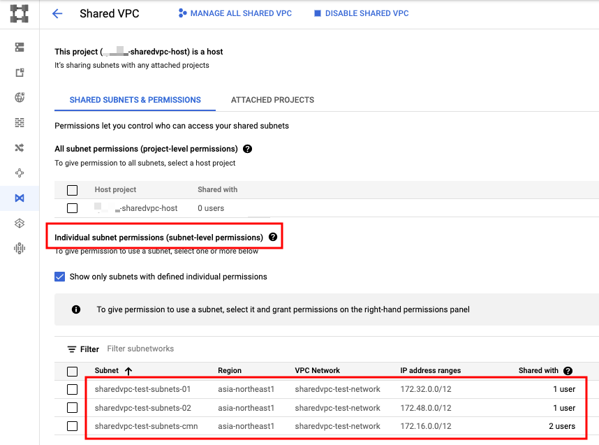

# Quick Start

## 概要

3 つの GCP Project を使って、共有 VPC を試してみる

```
Provisioning Shared VPC
https://cloud.google.com/vpc/docs/provisioning-shared-vpc
```

+ イメージ図


## 準備

共有 VPC の作成には、以下の権限 ( Permission ) が必要になります

+ `compute.organizations.enableXpnHost`
  + 事前定義された Role: `Compute Shared VPC Admin ( roles/compute.xpnAdmin )` などに入っているので、適宜付与しましょう

## やってみる

1. GCP Project の準備
1. [共有 VPC の有効化](./README.md#2-共有-vpc-の有効化)
1. [共有するネットワークの作成](./README.md#3-共有するネットワークの作成)
1. [Host Project の Subnets を Service Project に共有する](./README.md#4-host-project-の-subnets-を-service-project-に共有する)


## 1. GCP Project の準備

既に 3 つの GCP Project があるとします

```
export _common='sharedvpc-test'


### 共有 VPC の Host Project ID
export _sharedvpc_host_id='sharedvpc-host'


### 共有 VPC の Service Project ID
export _sharedvpc_svr_01_id='sharedvpc-service-01'
export _sharedvpc_svr_02_id='sharedvpc-service-02'
```


## 2. 共有 VPC の有効化

+ 共有 VPC の Host Project となる GCP Project に対して、共有 VPC を有効にします

```
gcloud beta compute shared-vpc enable ${_sharedvpc_host_id}
```

また、共有 VPC の Service Project の管理者が共有 VPC を使用するには、Service Project が Host Project に **接続されている** 必要があり、共有 VPC 管理者は以下の手順で接続を完了する必要があります。

制約として、Service Project は 1 つ Host Project にのみ接続できますが、Host Project は複数の Service Project の接続をサポートしています。

その他の制限は [共有 VPC プロジェクトの上限](https://cloud.google.com/vpc/docs/quota#shared-vpc) を参照してください。

+ Service Project を Host Project 接続します

```
### sharedvpc-host <---> sharedvpc-service-01
gcloud beta compute shared-vpc associated-projects add ${_sharedvpc_svr_01_id} \
    --host-project ${_sharedvpc_host_id}


### sharedvpc-host <---> sharedvpc-service-02
gcloud beta compute shared-vpc associated-projects add ${_sharedvpc_svr_02_id} \
    --host-project ${_sharedvpc_host_id}
```

+ 共有 VPC としてができる状態にあるか確認してみる

```
gcloud beta compute shared-vpc list-associated-resources ${_sharedvpc_host_id}
```
```
### 例

$ gcloud beta compute shared-vpc list-associated-resources ${_sharedvpc_host_id}
RESOURCE_ID           RESOURCE_TYPE
sharedvpc-service-01  PROJECT
sharedvpc-service-02  PROJECT
```

これで有効化は完了です

## 3. 共有するネットワークの作成

Host Project に Service Project と共有したいネットワークを作成します

今回は以下の 3 つのサブネットを作成します

+ `sharedvpc-host` と `sharedvpc-service-01` で共有する Subnets
+ `sharedvpc-host` と `sharedvpc-service-02` で共有する Subnets
+ 3 つの GCP Project で共有する Subnets

[再掲] イメージ図


+ 環境変数を設定しておきます

```
### Env

export _region='asia-northeast1'

export _sub_network_range_cmn='172.16.0.0/12'
export _sub_network_range_01='172.32.0.0/12'
export _sub_network_range_02='172.48.0.0/12'
```

+ VPC Network の作成

```
gcloud beta compute networks create ${_common}-network \
  --subnet-mode=custom \
  --project ${_sharedvpc_host_id}
```

+ Subnets の作成
  + 3 種類作成します ( 01 用, 02 用、3 つ用 )

```
### 3 つ用
gcloud beta compute networks subnets create ${_common}-subnets-cmn \
  --network ${_common}-network \
  --region ${_region} \
  --range ${_sub_network_range_cmn} \
  --enable-private-ip-google-access \
  --project ${_sharedvpc_host_id}


### 01 用
gcloud beta compute networks subnets create ${_common}-subnets-01 \
  --network ${_common}-network \
  --region ${_region} \
  --range ${_sub_network_range_01} \
  --enable-private-ip-google-access \
  --project ${_sharedvpc_host_id}


### 02 用
gcloud beta compute networks subnets create ${_common}-subnets-02 \
  --network ${_common}-network \
  --region ${_region} \
  --range ${_sub_network_range_02} \
  --enable-private-ip-google-access \
  --project ${_sharedvpc_host_id}
```

+ Firewall Rules の作成

```
### 3 つ用
gcloud beta compute firewall-rules create ${_common}-cmn-allow-internal-all \
  --network ${_common}-network \
  --action ALLOW \
  --rules tcp:0-65535,udp:0-65535,icmp \
  --source-ranges ${_sub_network_range_cmn} \
  --target-tags ${_common}-cmn-allow-internal-all \
  --project ${_sharedvpc_host_id}


### 01 用
gcloud beta compute firewall-rules create ${_common}-01-allow-internal-all \
  --network ${_common}-network \
  --action ALLOW \
  --rules tcp:0-65535,udp:0-65535,icmp \
  --source-ranges ${_sub_network_range_01} \
  --target-tags ${_common}-01-allow-internal-all \
  --project ${_sharedvpc_host_id}


### 02 用
gcloud beta compute firewall-rules create ${_common}-02-allow-internal-all \
  --network ${_common}-network \
  --action ALLOW \
  --rules tcp:0-65535,udp:0-65535,icmp \
  --source-ranges ${_sub_network_range_01} \
  --target-tags ${_common}-02-allow-internal-all \
  --project ${_sharedvpc_host_id}
```

これでネットワークの作成は完了です

## 4. Host Project の Subnets を Service Project に共有する

+ [推奨] Host Project の特定の Subnets のみを Service Project に共有する
  + よりセキュアになるため、こちらが推奨です
+ Host Project の全ての Subnets を Service Project に共有する
  + このページでは解説していないので、詳細は公式ページを参照してください
  + [Provisioning Shared VPC](https://cloud.google.com/vpc/docs/provisioning-shared-vpc)

### Host Project の特定の Subnets のみを Service Project に共有する

+ 先に Service Project の Google APIs service account を調べておきます

```
Google APIs service account == {SERVICE_PROJECT_NUMBER}@cloudservices.gserviceaccount.com
の形
```

+ 環境変数に設定します

```
export _service_pj_01_sa='Service Project 01 の Google APIs service account'
export _service_pj_02_sa='Service Project 02 の Google APIs service account'
```

### sharedvpc-host <---> sharedvpc-service-01 の設定


+ Subnetst `sharedvpc-service-01` の現在のポリシーバインディングを JSON 形式で取得します

```
gcloud beta compute networks subnets get-iam-policy ${_common}-subnets-01 \
  --region ${_region} \
  --project ${_sharedvpc_host_id} \
  --format json
```
```
### 例

$ gcloud beta compute networks subnets get-iam-policy ${_common}-subnets-01 \
  --region ${_region} \
  --project ${_sharedvpc_host_id} \
  --format json
{
  "etag": "ACAB"
}
```

+ Subnets `sharedvpc-service-01` の現在のポリシーバインディングを JSON 形式で保存します
  + subnet-policy-01.json というファイルに書き出します

```
gcloud beta compute networks subnets get-iam-policy ${_common}-subnets-01 \
  --region ${_region} \
  --project ${_sharedvpc_host_id} \
  --format json > subnet-policy-01.json
```

+ 共有 VPC の設定のために subnet-policy-01.json を修正します

```
cat << __EOF__ > subnet-policy-01.json
{
  "bindings": [
  {
     "members": [
           "serviceAccount:${_service_pj_01_sa}"
        ],
        "role": "roles/compute.networkUser"
  }
  ],
  "etag": "ACAB"
}
__EOF__
```

+ subnet-policy-01.json を使用して、共有 VPC の Subnets のポリシーバインディングを更新します

```
gcloud beta compute networks subnets set-iam-policy ${_common}-subnets-01 subnet-policy-01.json \
  --region ${_region} \
  --project ${_sharedvpc_host_id}
```

これで sharedvpc-host <---> sharedvpc-service-01 の設定は完了です

### sharedvpc-host <---> sharedvpc-service-02 の設定


+ Subnets `sharedvpc-service-02` の現在のポリシーバインディングを JSON 形式で取得します

```
gcloud beta compute networks subnets get-iam-policy ${_common}-subnets-02 \
  --region ${_region} \
  --project ${_sharedvpc_host_id} \
  --format json
```
```
### 例

$ gcloud beta compute networks subnets get-iam-policy ${_common}-subnets-02 \
  --region ${_region} \
  --project ${_sharedvpc_host_id} \
  --format json
{
  "etag": "ACAB"
}
```

+ Subnets `sharedvpc-service-02` の現在のポリシーバインディングを JSON 形式で保存します
  + subnet-policy-02.json というファイルに書き出します

```
gcloud beta compute networks subnets get-iam-policy ${_common}-subnets-02 \
  --region ${_region} \
  --project ${_sharedvpc_host_id} \
  --format json > subnet-policy-02.json
```

+ 共有 VPC の設定のために subnet-policy-02.json を修正します

```
cat << __EOF__ > subnet-policy-02.json
{
  "bindings": [
  {
     "members": [
           "serviceAccount:${_service_pj_02_sa}"
        ],
        "role": "roles/compute.networkUser"
  }
  ],
  "etag": "ACAB"
}
__EOF__
```

+ subnet-policy-02.json を使用して、共有 VPC の Subnets のポリシーバインディングを更新します

```
gcloud beta compute networks subnets set-iam-policy ${_common}-subnets-02 subnet-policy-02.json \
  --region ${_region} \
  --project ${_sharedvpc_host_id}
```

これで sharedvpc-host <---> sharedvpc-service-02 の設定は完了です


### 3 つ用の設定


+ Subnets `sharedvpc-service-cmn` の現在のポリシーバインディングを JSON 形式で取得します

```
gcloud beta compute networks subnets get-iam-policy ${_common}-subnets-cmn \
  --region ${_region} \
  --project ${_sharedvpc_host_id} \
  --format json
```
```
### 例

$ gcloud beta compute networks subnets get-iam-policy ${_common}-subnets-cmn \
  --region ${_region} \
  --project ${_sharedvpc_host_id} \
  --format json
{
  "etag": "ACAB"
}
```

+ Subnets `sharedvpc-service-cmn` の現在のポリシーバインディングを JSON 形式で保存します
  + subnet-policy-cmn.json というファイルに書き出します

```
gcloud beta compute networks subnets get-iam-policy ${_common}-subnets-cmn \
  --region ${_region} \
  --project ${_sharedvpc_host_id} \
  --format json > subnet-policy-cmn.json
```

+ 共有 VPC の設定のために subnet-policy-cmn.json を修正します

```
cat << __EOF__ > subnet-policy-cmn.json
{
  "bindings": [
  {
     "members": [
           "serviceAccount:${_service_pj_01_sa}",
           "serviceAccount:${_service_pj_02_sa}"
        ],
        "role": "roles/compute.networkUser"
  }
  ],
  "etag": "ACAB"
}
__EOF__
```

+ subnet-policy-cmn.json を使用して、共有 VPC の Subnets のポリシーバインディングを更新します

```
gcloud beta compute networks subnets set-iam-policy ${_common}-subnets-cmn subnet-policy-cmn.json \
  --region ${_region} \
  --project ${_sharedvpc_host_id}
```

これで 3 つ用の設定は完了です

### 確認

ここまでの作業で以下の構成が出来ました


実際に GUI で見えてみると以下のようになっています



これで作りたい構成は出来ました :)

## まとめ

共有 VPC をコマンドラインで作ることが出来ました!

実際に通信が制御できているかは、別途検証したいと思います :)
