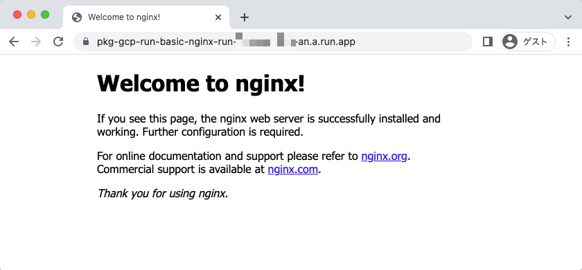

# nginx のサンプル

## 概要

WIP

## ローカル環境での確認

+ 先に環境変数に入れておく

```
export _common_name='pkg-gcp-run-basic-nginx'
```

+ コンテナを起動する

```
docker run --name ${_common_name}-local -d -p 8080:80 nginx:1.23.1-alpine
```

+ cURL で確認する

```
$ curl localhost:8080
<!DOCTYPE html>
<html>
<head>
<title>Welcome to nginx!</title>
<style>
html { color-scheme: light dark; }
body { width: 35em; margin: 0 auto;
font-family: Tahoma, Verdana, Arial, sans-serif; }
</style>
</head>
<body>
<h1>Welcome to nginx!</h1>
<p>If you see this page, the nginx web server is successfully installed and
working. Further configuration is required.</p>

<p>For online documentation and support please refer to
<a href="http://nginx.org/">nginx.org</a>.<br/>
Commercial support is available at
<a href="http://nginx.com/">nginx.com</a>.</p>

<p><em>Thank you for using nginx.</em></p>
</body>
</html>
```

+ コンテナ停止と削除

```
docker stop  ${_common_name}-local
docker rm -f ${_common_name}-local
```

## Artifact Registry を準備する

+ 先に環境変数に入れておく

```
export _ar_repo="${_common_name}-repo"
```

+ Artifact Registry のリポジトリを用意する
  + フォーマットは一番簡単な `Docker` で作成

```
gcloud beta artifacts repositories create ${_ar_repo} \
  --repository-format docker \
  --location ${_region} \
  --project ${_gcp_pj_id}
```

+ Artifact Registry のリポジトリの確認

```
gcloud beta artifacts repositories list --project ${_gcp_pj_id}
gcloud beta artifacts repositories describe ${_ar_repo} --location ${_region} --project ${_gcp_pj_id}
```

+ Artifact Registry Docker リポジトリに対する認証を構成する
  + asia-northeast1 のみ設定する
  + https://cloud.google.com/artifact-registry/docs/docker/authentication#gcloud-helper

```
gcloud auth configure-docker asia-northeast1-docker.pkg.dev
```
```
### 上記をしない場合は以下のようなエラーが出る(非常に分かりづらい)

denied: Permission "artifactregistry.repositories.downloadArtifacts" denied on resource "${_region}-docker.pkg.dev/${_gcp_pj_id}/${_ar_repo}" (or it may not exist)
```

## コンテナイメージを Artifact Registry にアップロードする

+ 先に環境変数に入れておく

```
export _container_name="${_common_name}-image"
export _TAG='latest'
```

+ コンテナイメージを作成

```
docker pull nginx:latest
```
```
docker tag \
  nginx:latest \
  ${_region}-docker.pkg.dev/${_gcp_pj_id}/${_ar_repo}/${_container_name}:${_TAG}
```

+ コンテナイメージを Artifact Registry にアップロードする

```
docker push ${_region}-docker.pkg.dev/${_gcp_pj_id}/${_ar_repo}/${_container_name}:${_TAG}
```

## Cloud Run にデプロイする

まずは基本的な動きを見るために GitHub にある nginx のコンテナをそのまま Cloud Run にデプロイする

+ 先に環境変数に入れておく

```
export _run_service="${_common_name}-run"
```

+ Cloud Run にデプロイをする

```
gcloud beta run deploy ${_run_service} \
  --image ${_region}-docker.pkg.dev/${_gcp_pj_id}/${_ar_repo}/${_container_name}:${_TAG} \
  --platform managed \
  --port=80 \
  --region ${_region} \
  --allow-unauthenticated \
  --project ${_gcp_pj_id}
```

+ Cloud Run の Service を確認する

```
gcloud beta run services describe ${_run_service} \
  --platform managed \
  --region ${_region} \
  --project ${_gcp_pj_id}
```
```
### 例

$ gcloud beta run services describe ${_run_service} --platform managed --region ${_region} --project ${_gcp_pj_id}
✔ Service pkg-gcp-run-basic-nginx-run in region asia-northeast1

URL:     https://pkg-gcp-run-basic-nginx-run-hogehoge.a.run.app
Ingress: all
Traffic:
  100% LATEST (currently pkg-gcp-run-basic-nginx-run-fugafuga)

Last updated on 2022-08-22T08:46:22.918131Z by hogehoge@gmail.com:
  Revision pkg-gcp-run-basic-nginx-run-fugafuga
  Image:           asia-northeast1-docker.pkg.dev/your_gcp_pj_id/pkg-gcp-run-basic-nginx-repo/pkg-gcp-run-basic-nginx-image:latest
  Port:            80
  Memory:          512Mi
  CPU:             1000m
  Service account: fizzbuzz-compute@developer.gserviceaccount.com
  Concurrency:     80
  Max Instances:   100
  Timeout:         300s
```

## Web ブラウザで確認する


