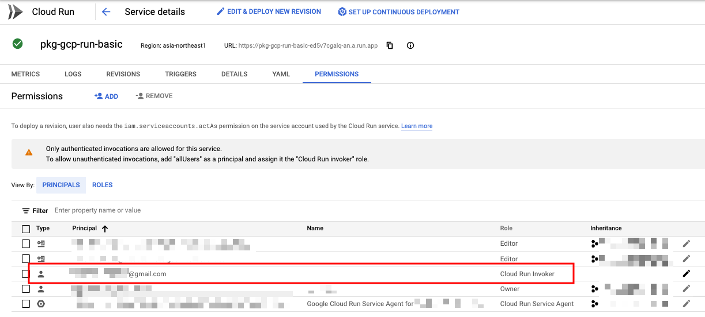
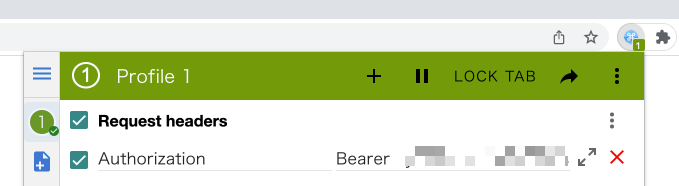
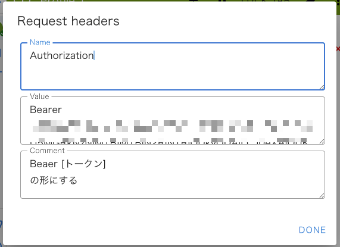
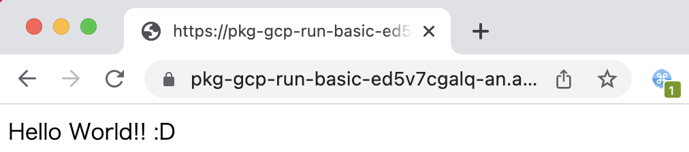

# User 認証

## 概要


Cloud Run でも認証できる

理想は GCLB を通して IAP を使った認証方法のほう


```
Authenticating developers
https://cloud.google.com/run/docs/authenticating/developers
```

## やってみる

### 登場人物

+ Google Account A
  + Cloud Run を使用している GCP Project 内で IAM などを変更出来る強い権限を持っている
+ Google Account X
  + Cloud Run 上にデプロイされた特定のサービスだけを閲覧のみ出来るユーザ
  + Cloud Run のページすら見れない


## 1. A がアプリを用意し、非公開でデプロイ

[package-gcp/run/basic/python]() で、 Cloud Run にデプロイするところまでやる 

```
export _gcp_pj_id='Your GCP PJ ID'
export _region='asia-northeast1'
export _run_service='pkg-gcp-run-basic'
export _container_image_name='pkg-gcp-run-basic'
```

+ Only Authorized User

```
gcloud run deploy ${_run_service} \
  --image ${_region}-docker.pkg.dev/${_gcp_pj_id}/pkg-gcp-run/${_container_image_name}:v1 \
  --port=80 \
  --region ${_region} \
  --no-allow-unauthenticated \
  --project ${_gcp_pj_id}
```

+ Check URL

```
### Sample

$ gcloud run services describe ${_run_service} --region ${_region} --project ${_gcp_pj_id} --format json | jq .status.url -r
https://pkg-gcp-run-basic-ed5v7cgalq-an.a.run.app
```

## 2. A　が X に対して Role を付与

+ X に対して、 `Cloud Run Invoker ( roles/run.invoker ) ` の Role を付与する

```
gcloud beta run services add-iam-policy-binding ${_run_service} \
  --region=${_region} \
  --member='user:igaguri.no.freemail@gmail.com' \
  --role='roles/run.invoker' \
  --project ${_gcp_pj_id}
```



## 3. X が自分の ID トークンを取得

+ GCP に認証する

```
gcloud auth login -q
```

+ ログインしているユーザの ID トークンを取得する

```
gcloud auth print-identity-token $(gcloud auth list --filter=status:ACTIVE --format="value(account)")
```
```
### Sample

# gcloud auth print-identity-token $(gcloud auth list --filter=status:ACTIVE --format="value(account)")
eyJxbG... ...2b4uiQ
```

---> 後ほど使うので、メモしておきましょう

## 4. アプリが取得できるか確認する

+ Cloud Run 上にデプロイされた特定のサービスの URL を貰う

```
export _run_service_url='https://pkg-gcp-run-basic-ed5v7cgalq-an.a.run.app'
```

## 4.1 コマンドラインで確認

+ cURL で確認する

```
curl -H "Authorization: Bearer $(gcloud auth print-identity-token $(gcloud auth list --filter=status:ACTIVE --format='value(account)'))" ${_run_service_url}
```
```
# curl -H "Authorization: Bearer $(gcloud auth print-identity-token $(gcloud auth list --filter=status:ACTIVE --format='value(account)'))" ${_run_service_url}
Hello World!! :D
```

### 4.2 Web ブラウザで確認

Web ブラウザにてヘッダを修正する必要があります

今回は `ModHeader` を利用します 

```
ModHeader
https://chrome.google.com/webstore/detail/modheader/idgpnmonknjnojddfkpgkljpfnnfcklj
```

Request header に `Authorization` を入れ、Value に`Bearer [自分の ID トークン]` を入れましょう






Web ブラウザでも無事に表示できました :D

