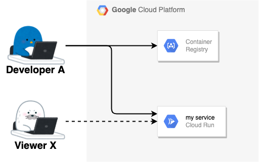
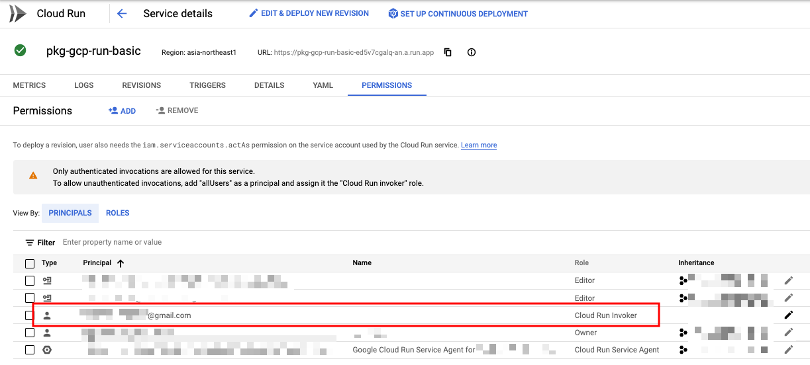
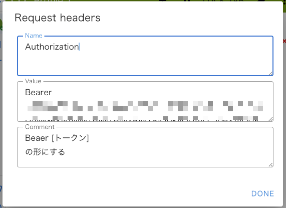
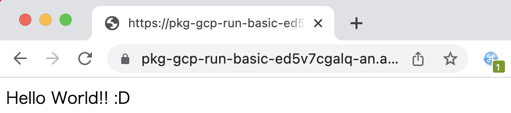

# ID トークンによる簡易認証

## 概要

Cloud Run に認証を付ける場合、理想は GCLB を通して IAP を使った認証方法を使うことです

しかし、簡易的に認証をつけることも可能です

ここでは Google Account の ID トークンを使った Cloud Run の簡易認証を試します

```
Authenticating developers
https://cloud.google.com/run/docs/authenticating/developers
```

## やってみる

### 登場人物

+ Google Account 1
  + Developer の A
  + Cloud Run を使用している GCP Project 内で IAM などを変更出来る強い権限を持っている
+ Google Account 2 = `viewer-xxx@gmail.com`
  + Viewer の X
  + Cloud Run 上にデプロイされた特定のサービスだけを閲覧のみ出来るユーザ
  + Cloud Run のページすら見れない



## 1. A がアプリを用意し、非公開でデプロイ

[package-gcp/run/basic/python](../basic/python/) で、 Cloud Run にデプロイするところまでやります 

+ 環境変数に予め情報をいれます

```
export            _gcp_pj_id='Your GCP PJ ID'
export               _region='asia-northeast1'
export          _run_service='pkg-gcp-run-basic'
export _container_image_name='pkg-gcp-run-basic'
```

+ Cloud Run を未公開でデプロイします

```
gcloud run deploy ${_run_service} \
  --image ${_region}-docker.pkg.dev/${_gcp_pj_id}/pkg-gcp-run/${_container_image_name}:v1 \
  --port=80 \
  --region ${_region} \
  --no-allow-unauthenticated \
  --project ${_gcp_pj_id}
```

+ Check URL

```
### Sample

$ gcloud run services describe ${_run_service} --region ${_region} --project ${_gcp_pj_id} --format json | jq .status.url -r
https://pkg-gcp-run-basic-ed5v7cgalq-an.a.run.app
```

## 2. A が X に対して Role を付与

+ X に対して、 `Cloud Run Invoker ( roles/run.invoker ) ` の Role を付与します

```
gcloud beta run services add-iam-policy-binding ${_run_service} \
  --region=${_region} \
  --member="user:viewer-xxx@gmail.com" \
  --role='roles/run.invoker' \
  --project ${_gcp_pj_id}
```



## 3. X が自分の ID トークンを取得

+ GCP に認証します

```
gcloud auth login -q
```

+ ログインしているユーザの ID トークンを取得します

```
gcloud auth print-identity-token $(gcloud auth list --filter=status:ACTIVE --format="value(account)")
```
```
### Sample

# gcloud auth print-identity-token $(gcloud auth list --filter=status:ACTIVE --format="value(account)")
eyJxbG... ...2b4uiQ
```

---> 後ほど使うので、メモしておきましょう

## 4. アプリが取得できるか確認する

+ X は A から Cloud Run 上にデプロイされた特定のサービスの URL を貰いましょう

```
export _run_service_url='https://pkg-gcp-run-basic-ed5v7cgalq-an.a.run.app'
```

## 4.1 X がコマンドラインで確認

+ cURL で確認します

```
curl -H "Authorization: Bearer $(gcloud auth print-identity-token $(gcloud auth list --filter=status:ACTIVE --format='value(account)'))" ${_run_service_url}
```
```
# curl -H "Authorization: Bearer $(gcloud auth print-identity-token $(gcloud auth list --filter=status:ACTIVE --format='value(account)'))" ${_run_service_url}
Hello World!! :D
```

---> 見ることが出来ました :D

### 4.2 X が Web ブラウザで確認

Web ブラウザにてヘッダを修正する必要があります

今回は `ModHeader` を利用します 

```
ModHeader
https://chrome.google.com/webstore/detail/modheader/idgpnmonknjnojddfkpgkljpfnnfcklj
```

Request header に `Authorization` を入れ、Value に`Bearer [自分の ID トークン]` を入れましょう




Web ブラウザでも無事に表示できました :D



---> 見ることが出来ました :D

:warning: ただし ID トークンは有効期限があるのでしばらくすると認証エラーになります。エラーになったらコマンドラインで再度 ID トークンを取得し、 ModHeader を修正しましょう

## 5. 備考

+ A が X の ID トークンを発行することも出来ます

```
gcloud auth print-identity-token viewer-xxx@gmail.com \
  --audiences="${_run_service_url}"
```

+ X ではなく、 Service Account でも発行することも出来ます
  + Service Account の Email = `my-account@example.iam.gserviceaccount.com` = `${_sa_email}`

```
gcloud auth print-identity-token \
  --impersonate-service-account="${_sa_email}" \
  --audiences="${_run_service_url}"
```
