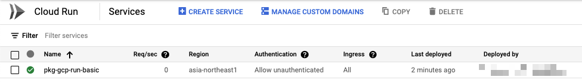
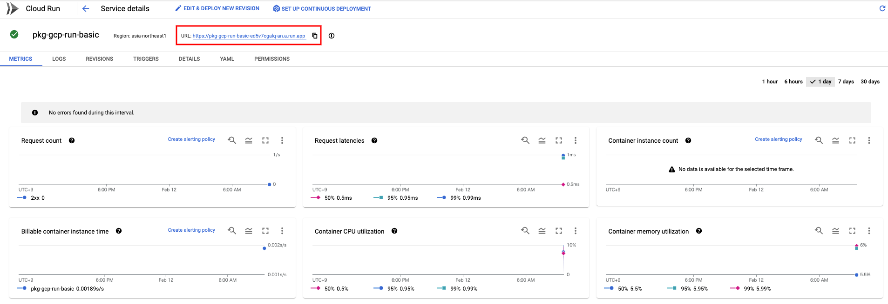
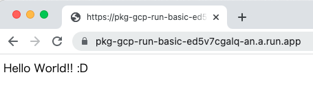

# Python

## Local Check

```
export _container_image_name='pkg-gcp-run-basic'
```

+ Build Container

```
docker build . --file Dockerfile --tag ${_container_image_name}
```

+ Local Run

```
docker run -d -p 8080:80 --name pkg-gcp-run-basic ${_container_image_name}
```

+ Check cURL

```
curl 0.0.0.0:8080
```
```
## Sample

$ curl 0.0.0.0:8080
Hello World!! :D
```

## Upload to Container Image

```
export _gcp_pj_id='Your GCP PJ ID'
export _region='asia-northeast1'
```

+ Add Tag of Artifact Registry

```
gcloud beta artifacts repositories create pkg-gcp-run \
  --repository-format docker \
  --location ${_region} \
  --project ${_gcp_pj_id}
```

+ Configure Docker

```
gcloud auth configure-docker asia-northeast1-docker.pkg.dev
```

+ Push Container Image

```
docker build . --file Dockerfile --tag ${_region}-docker.pkg.dev/${_gcp_pj_id}/pkg-gcp-run/${_container_image_name}:v1
docker push ${_region}-docker.pkg.dev/${_gcp_pj_id}/pkg-gcp-run/${_container_image_name}:v1
```

## Deploy to Cloud Run

```
export _run_service='pkg-gcp-run-basic'
```

+ Allow ALL User

```
gcloud run deploy ${_run_service} \
  --image ${_region}-docker.pkg.dev/${_gcp_pj_id}/pkg-gcp-run/${_container_image_name}:v1 \
  --port=80 \
  --region ${_region} \
  --allow-unauthenticated \
  --project ${_gcp_pj_id}
```

+ Only Authorized User

```
gcloud run deploy ${_run_service} \
  --image ${_region}-docker.pkg.dev/${_gcp_pj_id}/pkg-gcp-run/${_container_image_name}:v1 \
  --port=80 \
  --region ${_region} \
  --no-allow-unauthenticated \
  
```

## Check

+ Check URL

```
gcloud run services describe ${_run_service} --region ${_region} --project ${_gcp_pj_id}
```

+ Only URL

```
gcloud run services describe ${_run_service} --region ${_region} --project ${_gcp_pj_id} --format json | jq .status.url -r
```
```
### Sample

$ gcloud run services describe ${_run_service} --region ${_region} --project ${_gcp_pj_id} --format json | jq .status.url -r
https://pkg-gcp-run-basic-ed5v7cgalq-an.a.run.app
```

```
$ curl https://pkg-gcp-run-basic-ed5v7cgalq-an.a.run.app/
Hello World!! :D
```

### ScreenShot







## Shutdown

+ Delete Resource command

```
docker stop  pkg-gcp-run
docker rm -f pkg-gcp-run
docker rmi   pkg-gcp-run
```