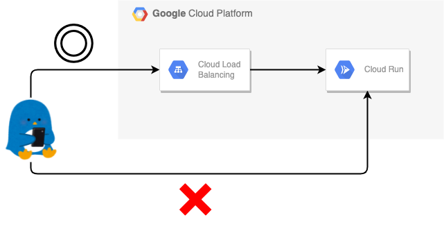
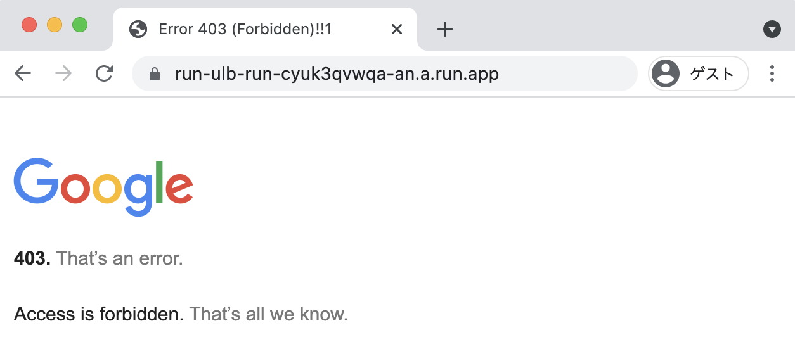

# Setting up a load balancer with Cloud Run

## 概要

Google Cloud Load Balancing( GCLB ) の下に Cloud run を設置する

その際に GCLB 経由のみ、アプリケーションを表示するようにしたい ( = Cloud Run の URL を直接開いても表示出来ないようにしたい )

```
### 公式ドキュメント

Setting up a load balancer with Cloud Run, App Engine, or Cloud Functions
https://cloud.google.com/load-balancing/docs/https/setting-up-https-serverless
```



## やってみる

## Cloud Run をデプロイする

```
### 公式ドキュメント

Build and deploy a Python service
https://cloud.google.com/run/docs/quickstarts/build-and-deploy/python
```

+ サンプルコードを clone する

```
git clone https://github.com/iganari/code-labo.git
cd code-labo/python/web-sample-all
```

+ 環境変数をいれておく

```
export _gcp_pj_id='Your GCP Project ID'
export _region='asia-northeast1'
export _common='pkg-gcp'
export _item='run-ulb'
```

+ Artifact Registry の有効化

```
gcloud beta services enable artifactregistry.googleapis.com --project ${_gcp_pj_id}
```

+ Artifact Registry に Docker リポジトリを作成

```
gcloud beta artifacts repositories create ${_common} \
  --repository-format docker \
  --location ${_region} \
  --project ${_gcp_pj_id}
```
```
gcloud auth configure-docker ${_region}-docker.pkg.dev
```

+ コンテナイメージを作成し、 Artifact Registry に PUSH

```
docker build . --tag ${_region}-docker.pkg.dev/${_gcp_pj_id}/${_common}/${_item}:latest
docker push ${_region}-docker.pkg.dev/${_gcp_pj_id}/${_common}/${_item}:latest
```

+ まずは Cloud Run を単純にデプロイする

```
gcloud run deploy ${_item}-run \
  --image ${_region}-docker.pkg.dev/${_gcp_pj_id}/${_common}/${_item}:latest \
  --port 5000 \
  --region ${_region} \
  --allow-unauthenticated \
  --platform managed \
  --project ${_gcp_pj_id}
```
```
### 例

# gcloud run deploy ${_item}-run \
>   --image ${_region}-docker.pkg.dev/${_gcp_pj_id}/${_common}/${_item}:latest \
>   --port 5000 \
>   --region ${_region} \
>   --allow-unauthenticated \
>   --platform managed \
>   --project ${_gcp_pj_id}
Deploying container to Cloud Run service [run-ulb-run] in project [your_gcp_pj_id] region [asia-northeast1]
✓ Deploying new service... Done.
  ✓ Creating Revision... Initializing project for the current region.
  ✓ Routing traffic...
  ✓ Setting IAM Policy...
Done.
Service [run-ulb-run] revision [run-ulb-run-00001-lag] has been deployed and is serving 100 percent of traffic.
Service URL: https://run-ulb-run-cyuk3qvwqa-an.a.run.app
```

+ Web ブラウザから確認する
  + 表示出来れば OK


+ オプションを指定して、 GCLB からの通信が来た時のみ表示するようにする
  + `--ingress internal-and-cloud-load-balancing`
  + https://cloud.google.com/run/docs/securing/ingress#setting_ingress

```
gcloud run services update ${_item}-run \
  --image ${_region}-docker.pkg.dev/${_gcp_pj_id}/${_common}/${_item}:latest \
  --port 5000 \
  --region ${_region} \
  --platform managed \
  --ingress internal-and-cloud-load-balancing \
  --project ${_gcp_pj_id}
```

+ Web ブラウザから確認する
  + 403 になれば OK


## GCLB で使用する External IP アドレスを予約する

+ gcloud コマンドで実施

```
gcloud beta compute addresses create ${_item}-ip \
  --ip-version=IPV4 \
  --global \
  --project ${_gcp_pj_id}
```

+ 予約した External IP アドレスを確認

```
gcloud beta compute addresses describe ${_item}-ip \
  --format="get(address)" \
  --global \
  --project ${_gcp_pj_id}
```
```
### 例

# gcloud beta compute addresses describe ${_item}-ip \
>   --format="get(address)" \
>   --global \
>   --project ${_gcp_pj_id}
35.227.196.133
```

## ドメインを決める

+ 今回は以下のドメイン ( `run-ulb.iganari.xyz` ) を使用します


## GCLB を作っていく

+ Google-managed SSL certificate を作る

```
gcloud beta compute ssl-certificates create ${_item}-cer \
  --domains run-ulb.iganari.xyz \
  --global \
  --project ${_gcp_pj_id}
```

+ serverless NEG を作る

```
gcloud beta compute network-endpoint-groups create ${_item}-serverlessneg \
  --region ${_region} \
  --network-endpoint-type serverless  \
  --cloud-run-service ${_item}-run \
  --project ${_gcp_pj_id}
```

+ Backend Service を作る

```
gcloud beta compute backend-services create ${_item}-bs \
  --global \
  --project ${_gcp_pj_id}
```

+ Serverless NEG を Backend Service の Backend に登録する

```
gcloud beta compute backend-services add-backend ${_item}-bs \
  --global \
  --network-endpoint-group ${_item}-serverlessneg \
  --network-endpoint-group-region ${_region} \
  --project ${_gcp_pj_id}
```

+ URL map を作る

```
gcloud beta compute url-maps create ${_item}-urlmap \
  --default-service ${_item}-bs \
  --project ${_gcp_pj_id}
```

+ HTTPS target proxy を作る
  + 先に作った Google-managed SSL certificate も使用する

```
gcloud beta compute target-https-proxies create ${_item}-httpstargetproxy \
  --ssl-certificates ${_item}-cer \
  --url-map ${_item}-urlmap \
  --project ${_gcp_pj_id}
```

+ Global Forwarding Rule を作る
  + HTTPS load balancer を作る

```
gcloud beta compute forwarding-rules create ${_item}-httpsforwadingrule \
  --address ${_item}-ip \
  --target-https-proxy ${_item}-httpstargetproxy \
  --global \
  --ports 443 \
  --project ${_gcp_pj_id}
```

## Web ブラウザから確認する

+ https://https://run-ulb.iganari.xyz/ にアクセスしてみる


+ SSL 証明書の確認


+ Cloud Run の素の URL から見ると未だに 403 になる




---> これでやりたい構成が出来ました :)

## リソースの削除

+ 環境変数を設定

```
export _gcp_pj_id='Your GCP Project ID'
export _region='asia-northeast1'
export _common='pkg-gcp'
export _item='run-ulb'
```

+ CLI でリソースを削除していく

```
gcloud beta compute forwarding-rules delete ${_item}-httpsforwadingrule \
  --global \
  --project ${_gcp_pj_id} \
  -q

gcloud beta compute target-https-proxies delete ${_item}-httpstargetproxy \
  --project ${_gcp_pj_id} \
  -q

gcloud beta compute url-maps delete ${_item}-urlmap \
  --project ${_gcp_pj_id} \
  -q

gcloud beta compute backend-services delete ${_item}-bs \
  --global \
  --project ${_gcp_pj_id} \
  -q

gcloud beta compute network-endpoint-groups delete ${_item}-serverlessneg \
  --region ${_region} \
  --project ${_gcp_pj_id} \
  -q

gcloud beta compute ssl-certificates delete ${_item}-cer \
  --global \
  --project ${_gcp_pj_id} \
  -q

gcloud beta compute addresses delete ${_item}-ip \
  --global \
  --project ${_gcp_pj_id} \
  -q

gcloud run services delete ${_item}-run \
  --region ${_region} \
  --project ${_gcp_pj_id} \
  -q

gcloud beta artifacts repositories delete ${_common} \
  --location ${_region} \
  --project ${_gcp_pj_id} \
  -q
```
