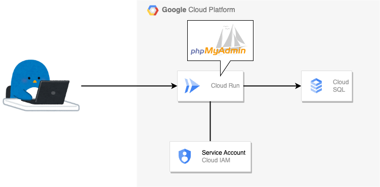
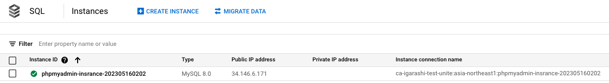
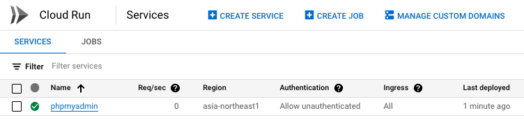
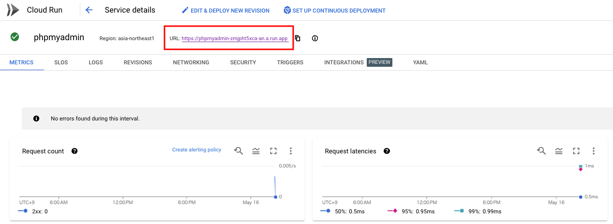
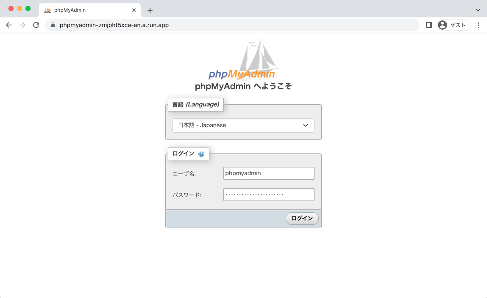
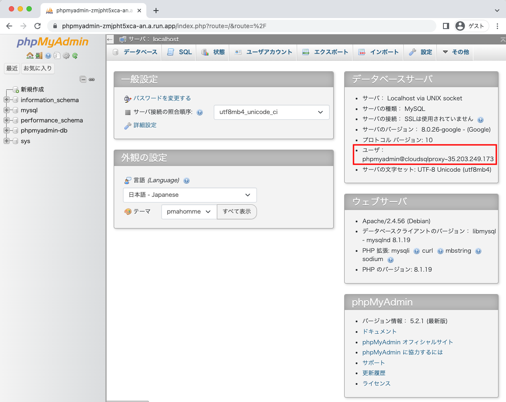

# Cloud Run 上に phpMyAdmin を起動する

## 概要

+ Cloud Run 上の phpMyAdmin を経由して Cloud SQL にアクセスする環境を構築します



+ 使用する phpMyAdmin は Docker Hub の公式コンテナイメージを使用する

```
### Docker Hub
https://hub.docker.com/_/phpmyadmin

### GitHub
https://github.com/phpmyadmin/docker
```

## 作ってみる

### 0. 事前の定義

+ 環境変数を設定する

```
export _gc_pj_id='Your Google Cloud Project ID'

export _common='phpmyadmin'
export _zone='asia-northeast1-b'
export _region='asia-northeast1'
export _date=`date +"%Y%m%d%H%M"`
```

+ API の有効化をする
  + 一回やれば OK

```
gcloud beta services enable sqladmin.googleapis.com --project ${_gc_pj_id}
```

### 1. Cloud SQL の準備

+ Cloud SQL instance を作成する

```
gcloud beta sql instances create ${_common}-insrance-${_date} \
  --database-version=MYSQL_8_0 \
  --tier=db-custom-1-3840 \
  --zone=${_zone} \
  --root-password=password123 \
  --project ${_gc_pj_id} \
  --async
```

+ Cloud SQL database を作成する

```
gcloud beta sql databases create ${_common}-db \
  --instance=${_common}-insrance-${_date} \
  --project ${_gc_pj_id} \
  --async
```

+ Cloud SQL 用の User を作成する

```
gcloud sql users create ${_common} \
  --instance=${_common}-insrance-${_date} \
  --password=${_gc_pj_id} \
  --project ${_gc_pj_id} \
  --async
```



### 2. Service Account の作成

+ Cloud Run 用の Service Account を発行し、 Cloud SQL に接続できる最低限の Role を付与する

```
gcloud beta iam service-accounts create ${_common}-sa \
  --description="Cloud Run 用のサービスアカウント" \
  --display-name="${_common}-sa" \
  --project ${_gc_pj_id}
```

+ 上記で作成した Service Account に以下の Role を付与する
  + Role: **Cloud SQL Client**( `roles/cloudsql.client` )
  + [Cloud SQL | Connect from Cloud Run](https://cloud.google.com/sql/docs/mysql/connect-run#configure)

```
gcloud beta projects add-iam-policy-binding ${_gc_pj_id} \
  --member="serviceAccount:${_common}-sa@${_gc_pj_id}.iam.gserviceaccount.com" \
  --role="roles/cloudsql.client"
```

### 3. Cloud Run にデプロイをする

+ Cloud Run の Service をデプロイする
  + [phpMyaAmin](https://hub.docker.com/_/phpmyadmin) の最新ののコンテナイメージ `phpmyadmin:5.2.1-apache` を使う
  + `--session-affinity` : phpMyAdmin がセッションを必要とするため。
  + `--service-account` : Cloud Run の Service Account の指定
  + `--set-env-vars` : **phpmyadmin:5.2.1-apache** が読み込める設定を Cloud Run の環境変数として設定
  + `--allow-unauthenticated` : サンプルなので allUser からのアクセスを許可

```
gcloud beta run deploy ${_common} \
  --project ${_gc_pj_id} \
  --image phpmyadmin:5.2.1-apache \
  --region ${_region} \
  --service-account "${_common}-sa@${_gc_pj_id}.iam.gserviceaccount.com" \
  --add-cloudsql-instances ${_gc_pj_id}:${_region}:${_common}-insrance-${_date} \
  --set-env-vars DB_USERNAME=${_common} \
  --set-env-vars DB_PASSWORD=${_gc_pj_id} \
  --set-env-vars PMA_HOST=localhost \
  --set-env-vars PMA_SOCKET="/cloudsql/${_gc_pj_id}:${_region}:${_common}-insrance-${_date}" \
  --set-env-vars APACHE_PORT=8080 \
  --session-affinity \
  --allow-unauthenticated
```

+ Cloud Run の Service の状態を確認する

```
gcloud beta run services describe phpadmin \
  --region ${_region} \
  --project ca-igarashi-test-unite
```

### 4. Web ブラウザから確認する









---> Cloud Run 上の phpMyAdmin 経由して Cloud SQL にアクセスすることが出来ました :)

## クリーンアップ

+ Cloud Run の Service を削除する

```
gcloud beta run services delete ${_common} \
  --region ${_region} \
  --project ${_gc_pj_id}
```

+ Cloud SQL のリソースを削除する

```
gcloud sql users delete ${_common} \
  --instance=${_common}-insrance-${_date} \
  --project ${_gc_pj_id} \
  --async

gcloud beta sql databases delete ${_common}-db \
  --instance=${_common}-insrance-${_date} \
  --project ${_gc_pj_id}

gcloud beta sql instances delete ${_common}-insrance-${_date} \
  --project ${_gc_pj_id}
```
