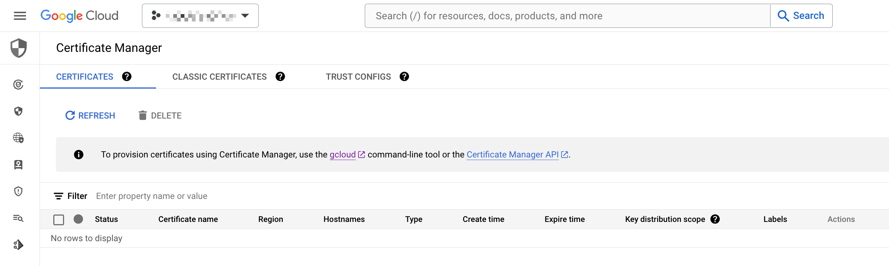

# Certificate Manager

## 公式ドキュメント

TBD

- 必要な API

```
### Certificate Manager API
certificatemanager.googleapis.com
```

## 使用方法

### 何が出来るの ?

- 単一ドメインの Google Cloud マネージド SSL 証明書を管理出来る
- ワイルドカード SSL 証明書も作ることがが出来る
  - `DNS 認証` のみ (2026/02)

### 注意



## Cloud SDK

+ SDK を用いて作成する
  + https://cloud.google.com/sdk/gcloud/reference/certificate-manager
  + https://cloud.google.com/sdk/gcloud/reference/beta/certificate-manager

```

```
