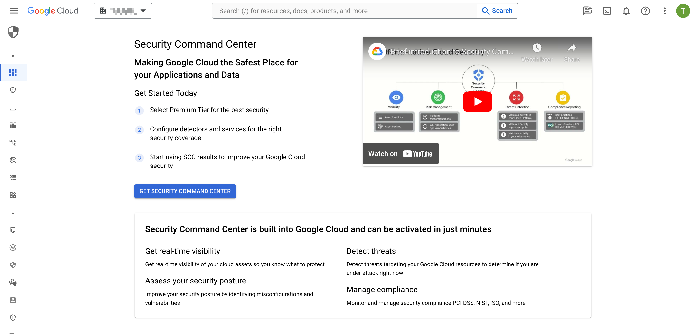
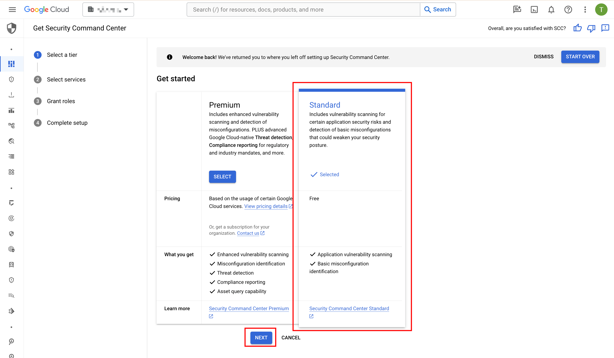
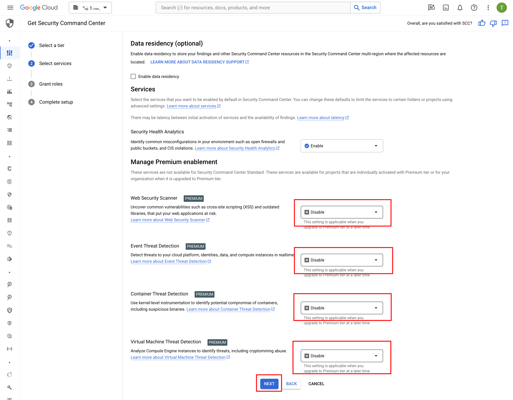
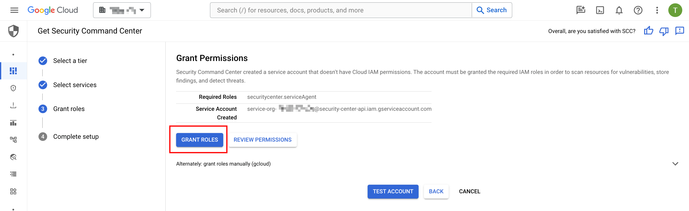
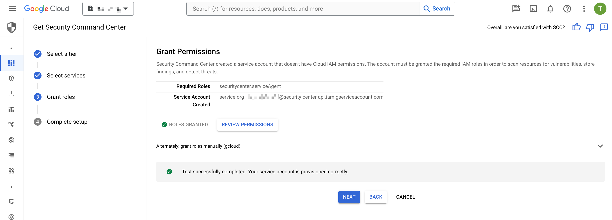
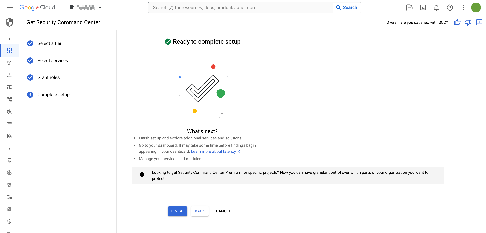

# Security Command Center

## 概要

TBD

## 有効化

01. Security Command Center のページに行きます

### 01. Security Command Center のページに行きます

02. Standard Tier を選択します

### 02. Standard Tier を選択します

### 03. hoge

### 04. hoge

### 05. hoge

### 06. hoge

