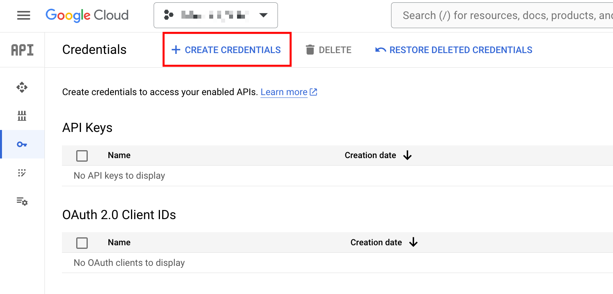
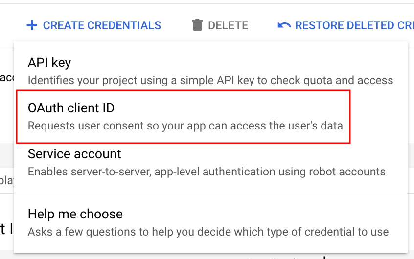
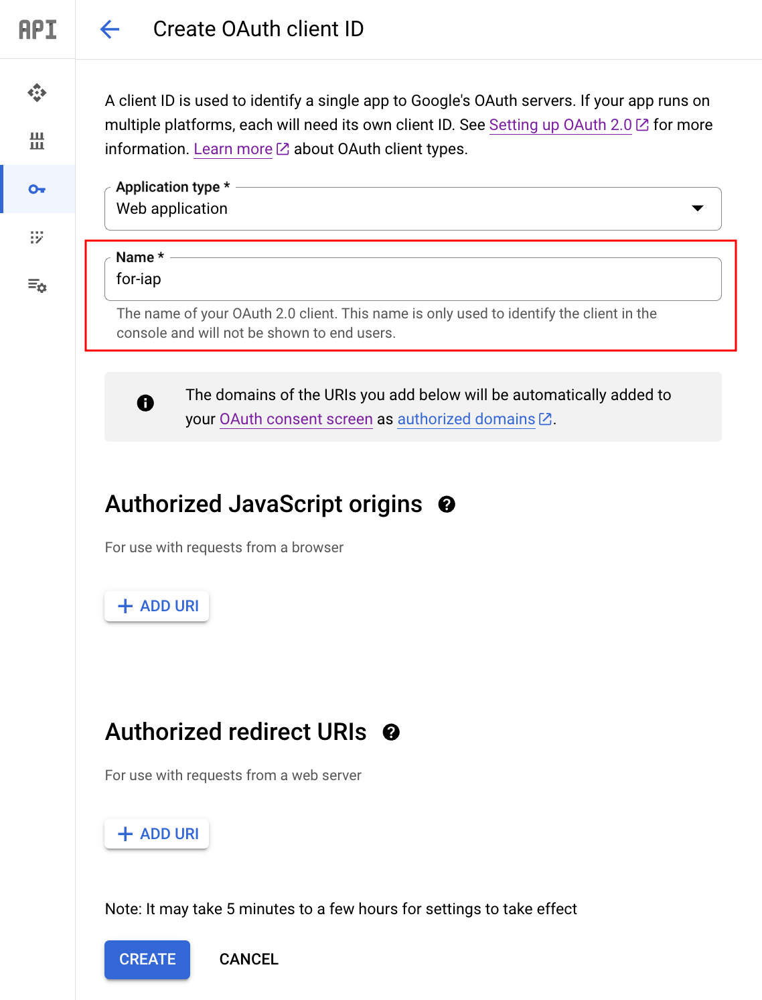
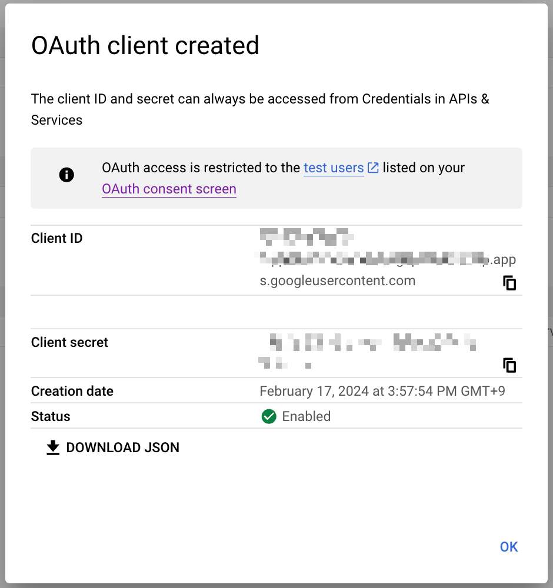
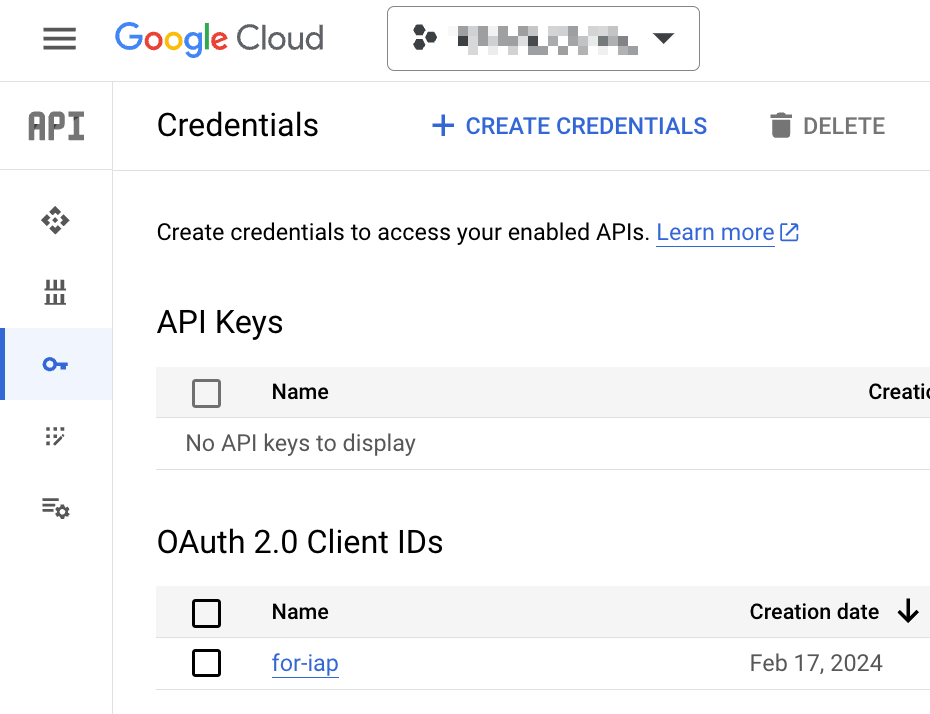
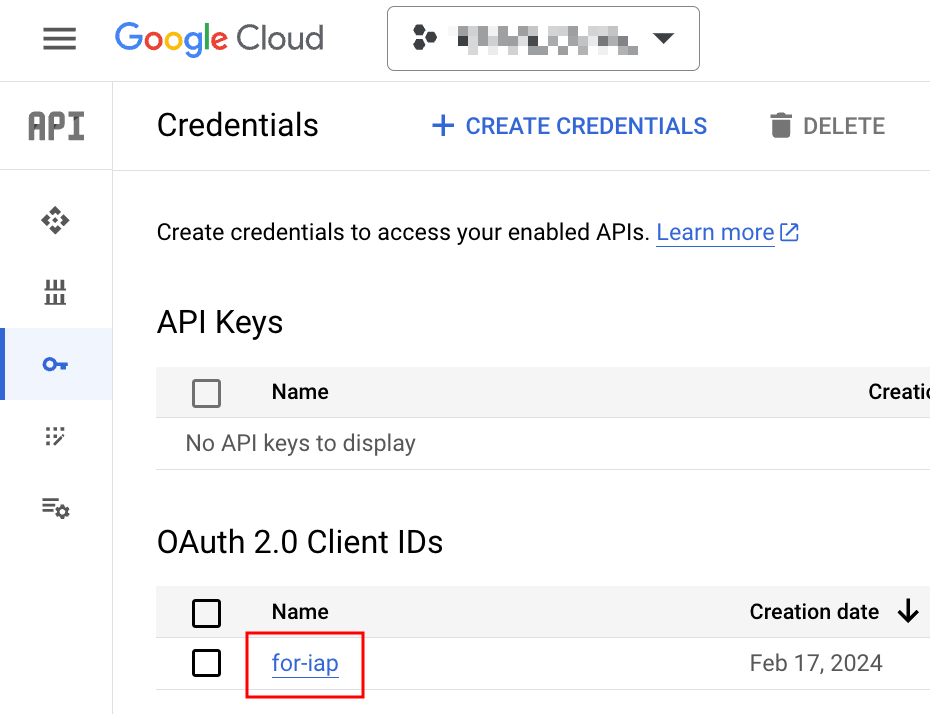
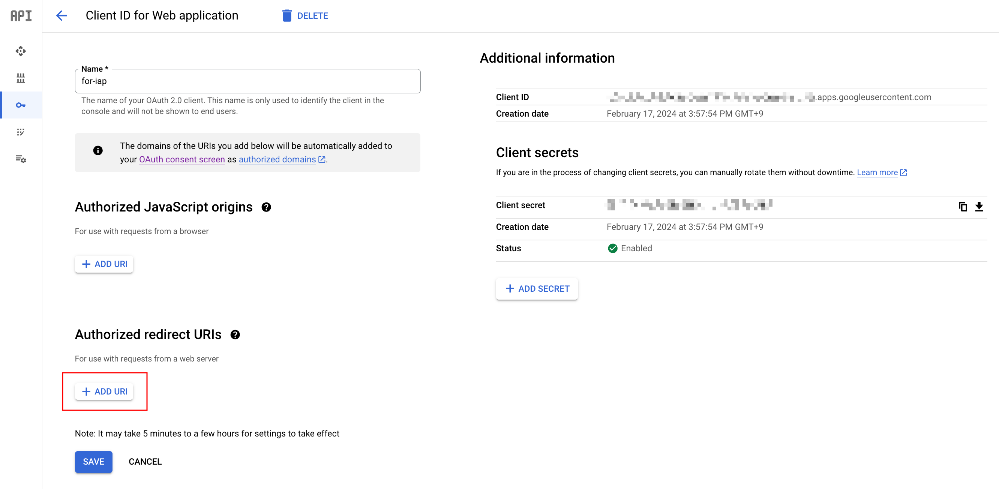
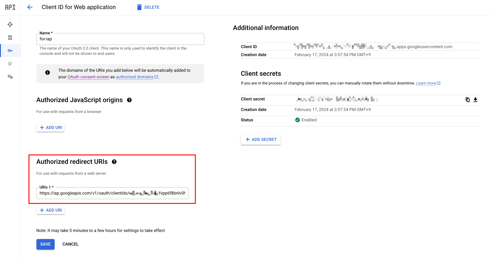

# for Terraform

## IAP をつける場合

Google Cloud の OAuth 2.0 Client IDs が API 経由で作成が出来ないため、完全に Terraform で構築できないので、以下の手順をする (2024/02)

## 1. Cloud Console で OAuth 2.0 Client IDs を作成

+ `Web application` を指定して Client ID を作成
+ 他のパラメータは無しでも良い

<details>
<summary>スクリーンショット</summary>











</details>

## 2. 作成した ID を修正

`Client ID` の値を使って `Authorized redirect URIs` を登録

```
https://iap.googleapis.com/v1/oauth/clientIds/{{ Client ID }}:handleRedirect
```

<details>
<summary>スクリーンショット</summary>







</details>

## 3. Terrafor で以下の設定を Backend Service にて追加

+ 以下が必要
  + Client ID
  + Client sercret

```
resource "google_compute_backend_service" "default" {
  name                  = "tf-test-backend-service-external"
  protocol              = "HTTP"
  load_balancing_scheme = "EXTERNAL"
  iap {
    oauth2_client_id     = "abc"
    oauth2_client_secret = "xyz"
  }
}
```

https://registry.terraform.io/providers/hashicorp/google/latest/docs/resources/compute_backend_service#example-usage---backend-service-external-iap
