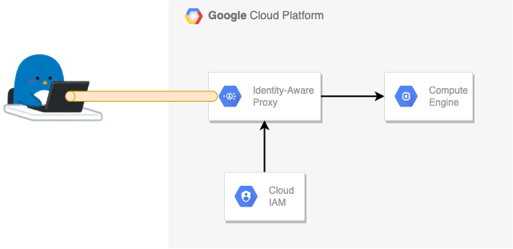

# IAP for TCP forwarding

## 概要





[Using IAP for TCP forwarding](https://cloud.google.com/iap/docs/using-tcp-forwarding)

## 共通

+ 事前に環境変数に入れておく

```
export _gcp_pj_id='Your GCP Project ID'
export _your_email='Your Google Account'
export _common='pkg-gcp-iap'
export _region='asia-northeast1'
export _sub_network_range='172.16.0.0/12'
```

## 外部 IP アドレスを持たない GCE VM の作成

+ ネットワークを作成

```
### VPC 作成
gcloud beta compute networks create ${_common}-network \
  --subnet-mode=custom \
  --project ${_gcp_pj_id}

### サブネット作成
gcloud beta compute networks subnets create ${_common}-subnets \
  --network ${_common}-network \
  --region ${_region} \
  --range ${_sub_network_range} \
  --enable-private-ip-google-access \
  --project ${_gcp_pj_id}

### 内部通信はすべて許可
gcloud beta compute firewall-rules create ${_common}-allow-internal-all \
  --network ${_common}-network \
  --action ALLOW \
  --rules tcp:0-65535,udp:0-65535,icmp \
  --source-ranges ${_sub_network_range} \
  --target-tags ${_common}-allow-internal-all \
  --project ${_gcp_pj_id}
```

+ Cloud NAT を作成します
    + External IP Address と Cloud Router も必要なので作成する

```
### External IP Address
gcloud beta compute addresses create ${_common}-nat-ip \
  --region ${_region} \
  --project ${_gcp_pj_id}

### Cloud Router
gcloud beta compute routers create ${_common}-nat-router \
  --network ${_common}-network \
  --region ${_region} \
  --project ${_gcp_pj_id}

### Cloud NAT
gcloud beta compute routers nats create ${_common}-nat \
  --router-region ${_region} \
  --router ${_common}-nat-router \
  --nat-all-subnet-ip-ranges \
  --nat-external-ip-pool ${_common}-nat-ip \
  --project ${_gcp_pj_id}
```

+ 外部 IP アドレスを持たない GCE VM の作成

```
gcloud beta compute instances create ${_common} \
  --zone ${_region}-b \
  --machine-type=f1-micro \
  --network-interface=subnet=${_common}-subnets,no-address \
  --maintenance-policy MIGRATE \
  --scopes https://www.googleapis.com/auth/cloud-platform \
  --image-project ubuntu-os-cloud \
  --image ubuntu-minimal-2110-impish-v20211014 \
  --shielded-secure-boot \
  --shielded-vtpm \
  --shielded-integrity-monitoring \
  --reservation-affinity any \
  --project ${_gcp_pj_id}
```


## IAM の設定

+ Role の付与

```
gcloud projects add-iam-policy-binding ${_gcp_pj_id} \
  --member=user:${_your_email} \
  --role=roles/iap.tunnelResourceAccessor
```
```
gcloud projects add-iam-policy-binding ${_gcp_pj_id} \
  --member=user:${_your_email} \
  --role=roles/compute.instanceAdmin.v1
```
```
gcloud projects add-iam-policy-binding ${_gcp_pj_id} \
  --member=user:${_your_email} \
  --role=roles/iam.serviceAccountUser
```


以降、分岐する

## 1. SSH の場合


+ Firewall Rules にて、 port 22 を許可する
  + 許可する IP range は IAP のバックエンド IP アドレスである `35.235.240.0/20`
  + tag を作成しておく ( ${_common}-allow-iap-ssh )

```
gcloud beta compute firewall-rules create ${_common}-allow-iap-ssh \
  --network ${_common}-network \
  --action ALLOW \
  --rules tcp:22,icmp \
  --source-ranges 35.235.240.0/20 \
  --target-tags ${_common}-allow-iap-ssh \
  --project ${_gcp_pj_id}
```

+ VM に tag ( ${_common}-allow-iap-ssh ) を追加する

```
gcloud beta compute instances add-tags ${_common} \
  --tags ${_common}-allow-iap-ssh \
  --zone ${_region}-b \
  --project ${_gcp_pj_id}
```

+ gcloud コマンドを用いて SSH 接続する

```
gcloud beta compute ssh ${_common} \
  --zone ${_region}-b \
  --tunnel-through-iap \
  --project ${_gcp_pj_id}
```


## 2. Other ( SSH 接続以外の場合 )


+ GCE に Jupyter Notebook を用意する

```
sudo apt update
sudo apt install python3-pip python3-dev
```
```
sudo -H pip3 install --upgrade pip
sudo -H pip3 install virtualenv
```
```
mkdir ~/jupyter-notebook-test
cd ~/jupyter-notebook-test
```
```
virtualenv .jupyter-notebook-test
source .jupyter-notebook-test/bin/activate
```

+ pip 経由で　Jupyter Notebook をインストール

```
pip install jupyter
```

+ 設定ファイルを作成

```
jupyter notebook --generate-config
```

+ 設定を変更

```
vim ~/.jupyter/jupyter_notebook_config.py
```
```
## The IP address the notebook server will listen on.
- c.NotebookApp.ip = 'localhost'
+ c.NotebookApp.ip = '0.0.0.0'
```

+ Jupyter Notebook を起動する
  + port 8888 で起動しているのが分かる

```
jupyter notebook
```
```
### 例

$ jupyter notebook
[I 15:38:09.497 NotebookApp] Writing notebook server cookie secret to /home/igarashi.toru/.local/share/jupyter/runtime/notebook_cookie_secret
[I 15:38:09.821 NotebookApp] Serving notebooks from local directory: /home/igarashi.toru/workspace/cainz/jupyter-notebook-test
[I 15:38:09.821 NotebookApp] Jupyter Notebook 6.4.5 is running at:
[I 15:38:09.821 NotebookApp] http://localhost:8888/?token=74451e59d595aa2709a393528f74a7f35306b40d6b838f3b
[I 15:38:09.821 NotebookApp]  or http://127.0.0.1:8888/?token=74451e59d595aa2709a393528f74a7f35306b40d6b838f3b
[I 15:38:09.821 NotebookApp] Use Control-C to stop this server and shut down all kernels (twice to skip confirmation).
[W 15:38:09.826 NotebookApp] No web browser found: could not locate runnable browser.
[C 15:38:09.826 NotebookApp]

    To access the notebook, open this file in a browser:
        file:///home/igarashi.toru/.local/share/jupyter/runtime/nbserver-24711-open.html
    Or copy and paste one of these URLs:
        http://localhost:8888/?token=74451e59d595aa2709a393528f74a7f35306b40d6b838f3b
     or http://127.0.0.1:8888/?token=74451e59d595aa2709a393528f74a7f35306b40d6b838f3b
```

+ 別 Terminal にて Firewall Rules を作る
  + port 8888 を許可する
  + 許可する IP range は IAP のバックエンド IP アドレスである `35.235.240.0/20`
  + tag を作成しておく ( ${_common}-allow-iap-ssh )

```
gcloud beta compute firewall-rules create ${_common}-allow-iap-jupyter \
  --network ${_common}-network \
  --action ALLOW \
  --rules tcp:8888,icmp \
  --source-ranges 35.235.240.0/20 \
  --target-tags ${_common}-allow-iap-jupyter \
  --project ${_gcp_pj_id}
```

+ VM に tag ( ${_common}-allow-iap-jupyter ) を追加する

```
gcloud beta compute instances add-tags ${_common} \
  --tags ${_common}-allow-iap-jupyter \
  --zone ${_region}-b \
  --project ${_gcp_pj_id}
```

+ Cloud IAP TCP Forwarding Tunnel を設定する

```
gcloud compute start-iap-tunnel ${_common} 8888 \
  --local-host-port=localhost:18888 \
  --zone ${_region}-b \
  --project ${_gcp_pj_id}
```


## 3. Other ( SSH 接続以外の場合 )


+ GCE に Jenkins を用意する

```
sudo apt update
sudo apt install openjdk-11-jdk
```
```
wget -q -O - https://pkg.jenkins.io/debian-stable/jenkins.io.key | sudo apt-key add -
sudo sh -c 'echo deb https://pkg.jenkins.io/debian-stable binary/ > /etc/apt/sources.list.d/jenkins.list'
sudo apt-get update
sudo apt-get install jenkins
```

+ Jenkins を起動する

```
sudo systemctl status jenkins
```

+ admin のパスワードを確認

```
sudo cat /var/lib/jenkins/secrets/initialAdminPassword
```


+ 別 Terminal にて Firewall Rules を作る
  + port 8080 を許可する
  + 許可する IP range は IAP のバックエンド IP アドレスである `35.235.240.0/20`
  + tag を作成しておく ( ${_common}-allow-iap-ssh )

```
gcloud beta compute firewall-rules create ${_common}-allow-iap-jenkins \
  --network ${_common}-network \
  --action ALLOW \
  --rules tcp:8080,icmp \
  --source-ranges 35.235.240.0/20 \
  --target-tags ${_common}-allow-iap-jenkins \
  --project ${_gcp_pj_id}
```

+ VM に tag ( ${_common}-allow-iap-jenkins ) を追加する

```
gcloud beta compute instances add-tags ${_common} \
  --tags ${_common}-allow-iap-jenkins \
  --zone ${_region}-b \
  --project ${_gcp_pj_id}
```

+ Cloud IAP TCP Forwarding Tunnel を設定する

```
gcloud compute start-iap-tunnel ${_common} 8080 \
  --local-host-port=localhost:18080 \
  --zone ${_region}-b \
  --project ${_gcp_pj_id}
```


## リソースの削除

+ VM の削除

```
gcloud beta compute instances delete ${_common} \
  --zone ${_region}-b \
  --project ${_gcp_pj_id}
```

+ ネットワークの削除

```
gcloud beta compute firewall-rules delete ${_common}-allow-iap-jupyter \
  --project ${_gcp_pj_id} -q

gcloud beta compute firewall-rules delete ${_common}-allow-iap-jenkins \
  --project ${_gcp_pj_id} -q

gcloud beta compute firewall-rules delete ${_common}-allow-iap-ssh \
  --project ${_gcp_pj_id} -q

gcloud beta compute firewall-rules delete ${_common}-allow-internal-all \
  --project ${_gcp_pj_id} -q

gcloud beta compute routers nats delete ${_common}-nat \
  --router-region ${_region} \
  --router ${_common}-nat-router \
  --project ${_gcp_pj_id} -q

gcloud beta compute routers delete ${_common}-nat-router \
  --region ${_region} \
  --project ${_gcp_pj_id} -q

gcloud beta compute addresses delete ${_common}-nat-ip \
  --region ${_region} \
  --project ${_gcp_pj_id} -q

gcloud beta compute networks subnets delete ${_common}-subnets \
  --region ${_region} \
  --project ${_gcp_pj_id} -q

gcloud beta compute networks delete ${_common}-network \
  --project ${_gcp_pj_id} -q
```


+ Role の付与

```
gcloud projects remove-iam-policy-binding ${_gcp_pj_id} \
  --member=user:${_your_email} \
  --role=roles/iap.tunnelResourceAccessor

gcloud projects remove-iam-policy-binding ${_gcp_pj_id} \
  --member=user:${_your_email} \
  --role=roles/compute.instanceAdmin.v1

gcloud projects remove-iam-policy-binding ${_gcp_pj_id} \
  --member=user:${_your_email} \
  --role=roles/iam.serviceAccountUser
```


Have fun!! :)
