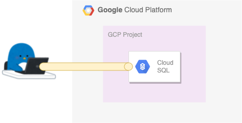
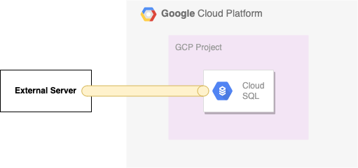

# Login to Cloud SQL using the Cloud SQL Auth proxy

## 概要

外部から Cloud SQL にセキュアにログインするための proxy

+ 公式ドキュメント

```
About the Cloud SQL Auth proxy
https://cloud.google.com/sql/docs/mysql/sql-proxy?hl=en
```
```
Connecting using the Cloud SQL Auth proxy
https://cloud.google.com/sql/docs/mysql/connect-admin-proxy?hl=en
```


## 必要なもの

### 1. Cloud SQL Auth Proxy

```
### 以下の公式ドキュメントから、 OS にあったアプリをダウンロードする
https://cloud.google.com/sql/docs/mysql/sql-proxy#install
```

### 2. IAM

+ IAM にて以下のどれか 1 つの Role を付与する
  + Cloud SQL Client ( roles/cloudsql.client )
  + Cloud SQL Editor ( roles/cloudsql.editor )
  + Cloud SQL Admin ( roles/cloudsql.admin )

---> Permission `cloudsql.instances.connect` が入っている Role であれば OK

```
https://cloud.google.com/sql/docs/mysql/sql-proxy#permissions
```

## クライアント PC から Cloud SQL Auth proxy で Cloud SQL に繋ぐ

詳細 ---> [from Client PC](./client-pc/)



## 一般的な Server 内から Cloud SQL Auth proxy で Cloud SQL に繋ぐ

詳細 ---> [from Server](./server/)


