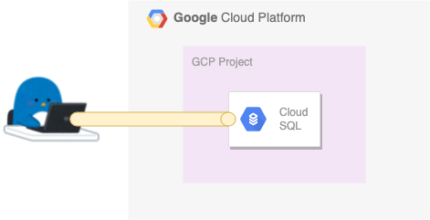
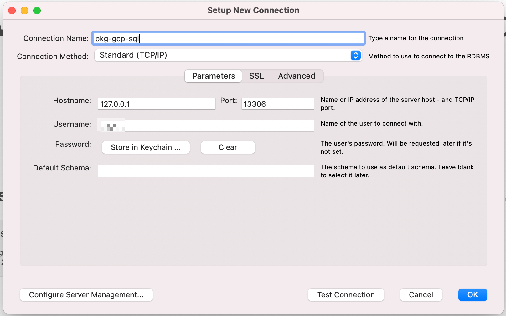
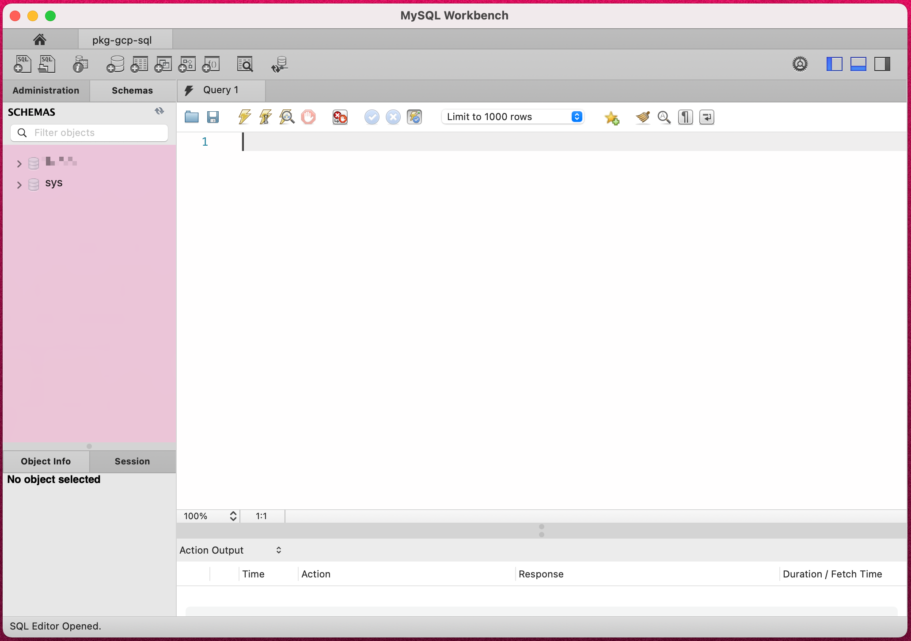

# Login to Cloud SQL using the Cloud SQL Auth proxy from Client PC

## 概要

外部から Cloud SQL にセキュアにログインするための proxy

+ 公式ドキュメント

```
About the Cloud SQL Auth proxy
https://cloud.google.com/sql/docs/mysql/sql-proxy?hl=en
```
```
Connecting using the Cloud SQL Auth proxy
https://cloud.google.com/sql/docs/mysql/connect-admin-proxy?hl=en
```


## やってみる

### Cloud SQL の準備

+ 以下の条件で Cloud SQL が出来ていることを前提とします
  + Cloud SQL for MySQL を使用
  + 外部 IP アドレス有りの Cloud SQL

+ Cloud SQL の Connection name を控えておきます
  + 以下のような名前になります

```
{Your GCP Project ID}:{Cloud SQL Instance Region}:{Cloud SQL Instance Name}
```

### IAM にて Role を付与

+ role の付与
  + Role: `Cloud SQL Admin ( roles/cloudsql.admin )` を付与する

```
gcloud beta projects add-iam-policy-binding {Your GCP Project ID} \
  --member="user:{Your GCP Account}" \
  --role="roles/cloudsql.admin" \
  --project {Your GCP Project ID}
```

### クライアント PC での準備

+ gcloud コマンドをインストールする
  + [Installing Cloud SDK](https://cloud.google.com/sdk/docs/install?hl=en)

```
$ gcloud version
Google Cloud SDK 355.0.0
```

+ Cloud SQL Auth proxy を取得し、実行可能な状態にする

```
sudo wget https://dl.google.com/cloudsql/cloud_sql_proxy.linux.amd64 -O /usr/local/bin/cloud_sql_proxy
sudo chmod +x /usr/local/bin/cloud_sql_proxy
```

+ 実行可能か確認する

```
cloud_sql_proxy --version
```
```
### 例

$ cloud_sql_proxy --version
Cloud SQL Auth proxy: 1.24.0+linux.amd64
```

## クライアント PC で Cloud SQL Auth Proxy を用いて繋げる

+ Cloud SQL の接続名を変数に入れる

```
export _con_name="{Your GCP Project ID}:{Cloud SQL Instance Region}:{Cloud SQL Instance Name}"
```

+ Cloud SQL Auth Proxy の起動

```
cloud_sql_proxy -instances=${_con_name}=tcp:0.0.0.0:13306 &
```

+ MySQL コマンドを使用して、 Cloud SQL に接続してみる

```
mysql -u {MySQL User name} -h 0.0.0.0 -p -P 13306
```
```
### 例

$ mysql -u {MySQL User name} -h 0.0.0.0 -p
Enter password:
Welcome to the MariaDB monitor.  Commands end with ; or \g.
Your MySQL connection id is 80978
Server version: 8.0.18-google (Google)

Copyright (c) 2000, 2018, Oracle, MariaDB Corporation Ab and others.

Type 'help;' or '\h' for help. Type '\c' to clear the current input statement.

MySQL [(none)]>
```

+ クライアントアプリを使用してCloud SQL に接続してみる





---> Cloud SQL にログイン出来ました :)

## 停止方法

+ ターミナルでプロセスを停止する

```
Ctrl + c
```
