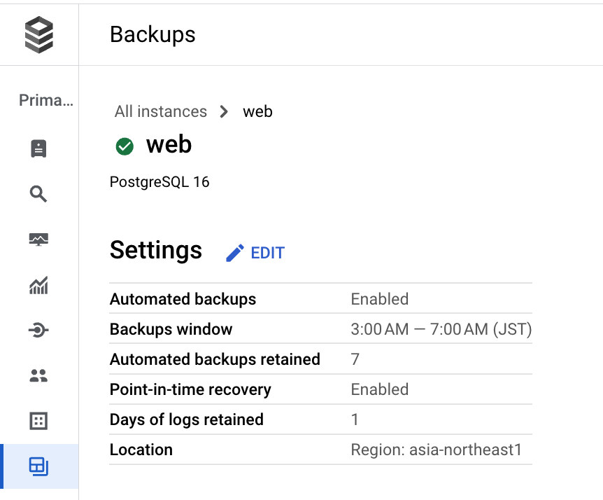
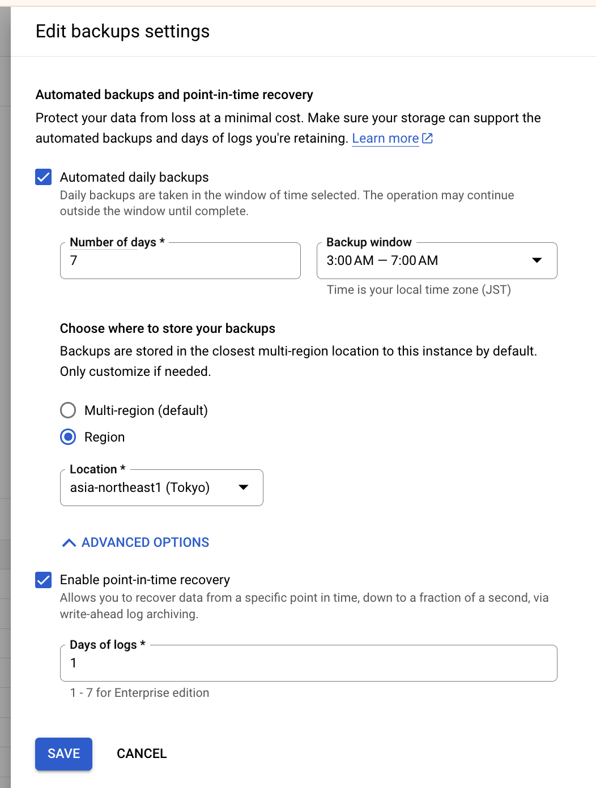

# Cloud SQL のバックアップについて

## 種類

- 基本的にはデイリーのバックアップを設定しておくのがよい
  - ロケーションが **Multi-region** OR **Region** の 2 択





## backup の確認

- 環境変数

```
export _sql_instance_id='Cloud SQL Instance ID'
export _gc_pj_id='Your Google Cloud ID'
```

- Backup のリストの確認

```
gcloud beta sql backups list \
  --instance ${_sql_instance_id} \
  --project ${_gc_pj_id}
```

- type が `ON_DEMAND` のものを抽出 ( `AUTOMATED` or `ON_DEMAND` )

```
gcloud beta sql backups list \
  --instance ${_sql_instance_id} \
  --project ${_gc_pj_id} \
  --filter="type=ON_DEMAND"
```

- type が `ON_DEMAND` のものかつ、 実行時間を降順で表示
  - `--sort-by` にて `~` を頭につけないと昇順、 `~` を頭につけると降順になる

```
gcloud beta sql backups list \
  --instance ${_sql_instance_id} \
  --project ${_gc_pj_id} \
  --filter="type=ON_DEMAND" \
  --sort-by="~WINDOW_START_TIME"
```

- type が `ON_DEMAND` のものかつ、 実行時間が最新のものを`7` 件残して削除する

```
export _delete_ids=$(gcloud beta sql backups list \
  --instance ${_sql_instance_id} \
  --project ${_gc_pj_id} \
  --filter="type=ON_DEMAND" \
  --sort-by="~WINDOW_START_TIME" | awk 'NR>8 {print $1}')

for i in ${_delete_ids}
  do
    echo '========================================================================================================='
    echo "Cloud SQL: ${_sql_instance_id} のバックアップID ${i} を削除します"
    echo "gcloud beta sql backups delete ${i} --instance ${_sql_instance_id} --project ${_gc_pj_id} --quiet --async"
    gcloud beta sql backups delete ${i} --instance ${_sql_instance_id} --project ${_gc_pj_id} --quiet --async
    echo "5 秒待ちます"
    sleep 5s
    echo '========================================================================================================='
  done
```
