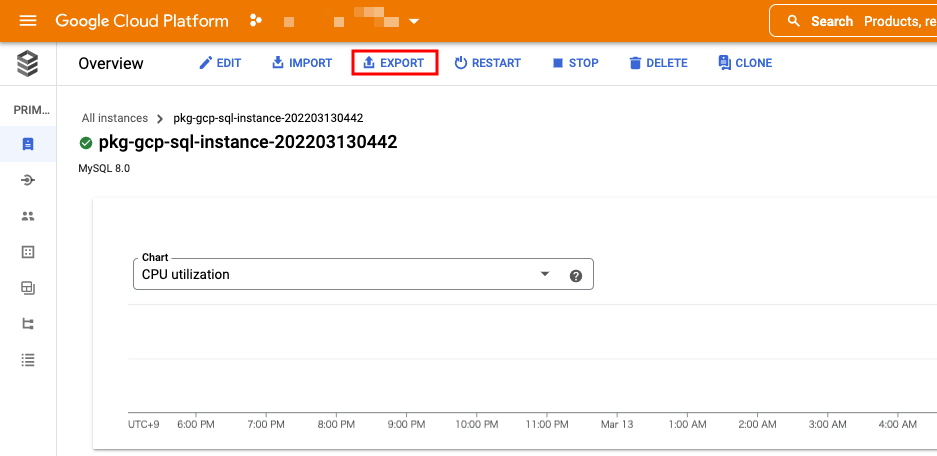

# Copy Another Cloud SQL

## 概要

Cloud SQL のデータを、他の Google Cloud Project 上にある Cloud SQL にコピーする


## やってみる

※ 複数やり方⁠⁠⁠⁠⁠⁠⁠があり、メリデリがあるので、加筆中

- CSV を使う方法
- バックアップデータを使う方法

### Cloud SQL のデータを Cloud Stoage に Export する



### Cloud Stoge のデータをコピーする

- Google Cloud Project A の Cloud Stoage のオブジェクトを、 Google Cloud Project B の Cloud Storage にコピーする
  - gsutil コマンドは Cloud Storage -> Cloud Storage のコピーが出来る
  - [cp - Copy files and objects](https://cloud.google.com/storage/docs/gsutil/commands/cp)

```
gsutil cp gs://{コピー元の Cloud Storage の Bucket 名}/{SQL ファイル}  gs://{コピー先の Cloud Storage の Bucket 名}/
```

### Cloud SQL のデータを Cloud Stoage に Import する


## 注意

- ユーザはコピーされない
  - 自分で作るしかない
- 所要の時間
  - GCS -> GCS はかなり早い
  - GCS -> SQL はかなり時間掛かる
    - Instance Type によるかもしれない
