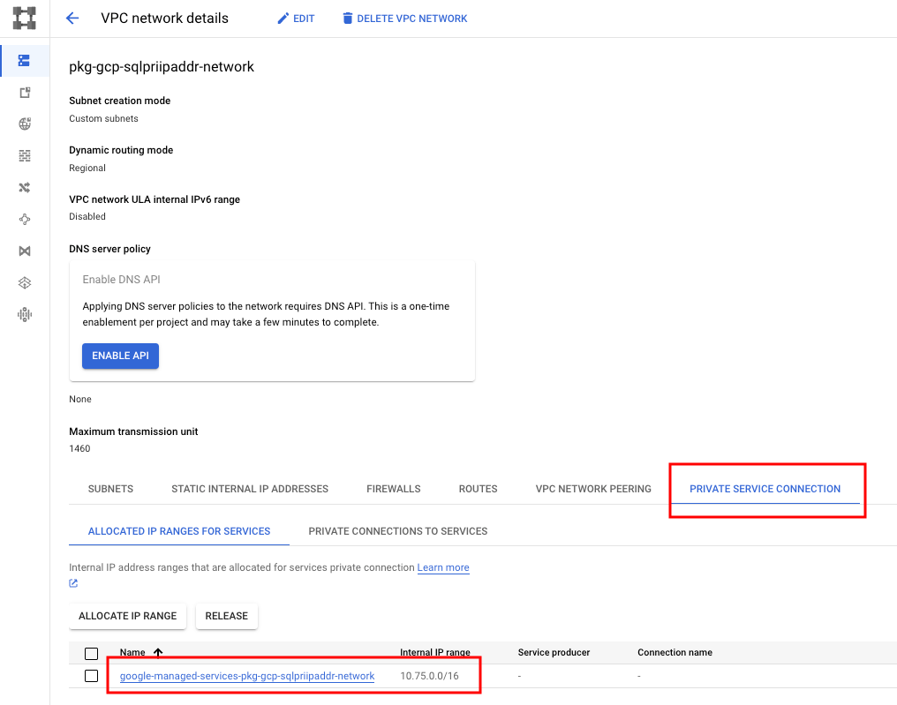
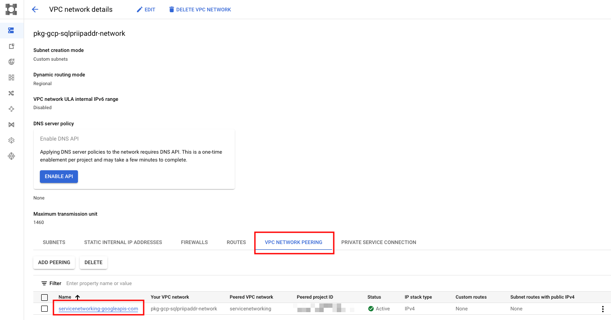

# プライベート IP アドレスしか持たない Cloud SQL の作成

## 概要

TBD

```
# Cloud SQL の接続について
https://cloud.google.com/sql/docs/mysql/connect-overview?hl=en
```
```
# 今回の構築方法は以下の公式ドキュメントにある
https://cloud.google.com/sql/docs/mysql/configure-private-services-access?hl=en
https://cloud.google.com/sql/docs/mysql/configure-private-ip?hl=en
https://cloud.google.com/sql/docs/mysql/create-instance?hl=en#create-2nd-gen
```

```
# 注意
今回の Cloud SQL Instance 作成時に --enable-google-private-path は敢えてつけていない
https://cloud.google.com/sql/docs/mysql/configure-private-ip?hl=en#new-private-instance
```


## 実際に構築する

### 0. 準備

+ Google Cloud に認証を通す

```
gcloud auth login --no-launch-browser -q
```

```
### Env

export _gc_pj_id='Your GCP Project ID'
# export _gc_pj_id='ca-igarashi-test-2023q3'

export _common='pkg-gcp-sqlpriipaddr'
export _region='asia-northeast1'
# export _zone='asia-northeast1-b'
export _sub_network_range='172.16.0.0/12'

# export _my_ip='Your Home IP Address'
# export _other_ip='Your other IP Address'
```

+ API を enable 化します

```
WIP
```

### 1. ネットワークの作成

+ VPC Network の作成します

```
gcloud beta compute networks create ${_common}-network \
  --subnet-mode=custom \
  --project ${_gc_pj_id}
```

+ サブネットの作成
  + `限定公開の Google アクセス` を On にしておく

```
gcloud beta compute networks subnets create ${_common}-subnets \
  --network ${_common}-network \
  --region ${_region} \
  --range ${_sub_network_range} \
  --enable-private-ip-google-access \
  --project ${_gc_pj_id}
```

+ Firewall

```
### 内部通信
gcloud beta compute firewall-rules create ${_common}-allow-internal-all \
  --network ${_common}-network \
  --action ALLOW \
  --rules tcp:0-65535,udp:0-65535,icmp \
  --source-ranges ${_sub_network_range} \
  --target-tags ${_common}-allow-internal-all \
  --project ${_gc_pj_id}
```

+ Allocate an IP address range
  + 割り当てるIPアドレスは範囲のみを指定する( Google Cloud がよしなにやってくれるのに任せる )
  + `16` の部分

```
# API の有効化

gcloud beta services enable servicenetworking.googleapis.com --project ${_gc_pj_id}
```
```
# private services connection の作成

gcloud beta compute addresses create google-managed-services-${_common}-network \
  --global \
  --purpose VPC_PEERING \
  --prefix-length 16 \
  --network=projects/${_gc_pj_id}/global/networks/${_common}-network \
  --project ${_gc_pj_id}
```



```
# private connection の作成

gcloud services vpc-peerings connect \
  --service servicenetworking.googleapis.com \
  --ranges google-managed-services-${_common}-network \
  --network ${_common}-network \
  --project ${_gc_pj_id}
```



### 02. Cloud SQL Instance の作成

※ Cloud SQL for MySQL を作ります

```
# API の有効化

gcloud beta services enable sqladmin.googleapis.com --project ${_gc_pj_id}
```

+ 環境変数を設定します
  + https://cloud.google.com/sql/docs/mysql/instance-settings#settings-2ndgen

```
export _date=`date +"%Y%m%d%H%M"`

export _database_ver='MYSQL_8_0'
export _machine_type='db-g1-small'
```
```
gcloud beta sql instances create ${_common}-${_date} \
  --database-version ${_database_ver} \
  --region ${_region} \
  --tier ${_machine_type} \
  --storage-size 10G \
  --storage-auto-increase \
  --network=projects/${_gc_pj_id}/global/networks/${_common}-network \
  --no-assign-ip \
  --project ${_gc_pj_id}
```

### 03. Cloud SQL Instance 内に database とユーザを作成

+ database の作成
  + https://cloud.google.com/sql/docs/mysql/create-manage-databases?hl=en

```
gcloud beta sql databases create ${_common} \
  --instance ${_common}-${_date} \
  --charset utf8 \
  --collation utf8_general_ci \
  --project ${_gc_pj_id}
```

+ ユーザの作成( 組み込み認証を使用 )
  + https://cloud.google.com/sql/docs/mysql/create-manage-users?hl=en#creating

```
gcloud sql users create iganari \
  --host="%" \
  --instance ${_common}-${_date} \
  --password ${_gc_pj_id} \
  --project ${_gc_pj_id}
```

### 04. Cloud SQL Instance にログインする

TBD

## 99. クリーンアップ

ハンズオン終了後は不要なリソースは削除しましょう ;)

<details>
<summary>Cloud SQL Instance の削除</summary>

```
gcloud beta sql instances delete ${_common}-${_date} \
  --project ${_gc_pj_id} \
  -q
```

</details>

<details>
<summary>Firewall Rule の削除</summary>

```
gcloud beta compute firewall-rules delete ${_common}-allow-internal-all \
  --project ${_gc_pj_id} \
  -q
```

</details>

<details>
<summary>Subnet の削除</summary>

```
gcloud beta compute networks subnets delete ${_common}-subnets \
  --region ${_region} \
  --project ${_gc_pj_id} \
  -q
```

</details>

<details>
<summary>private services connection の作成</summary>

```
gcloud beta compute addresses delete google-managed-services-${_common}-network \
  --global \
  --project ${_gc_pj_id} \
  -q
```

</details>

<details>
<summary>private connection の削除</summary>

:warning: CLI だと出来なかったので要検証

```
gcloud services vpc-peerings delete \
  --service='servicenetworking.googleapis.com' \
  --network ${_common}-network \
  --project ${_gc_pj_id} \
  -q
```

</details>

<details>
<summary>VPC Network の削除</summary>

```
gcloud beta compute networks delete ${_common}-network \
  --project ${_gc_pj_id} \
  -q
```

</details>
