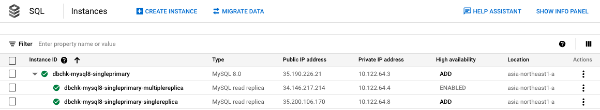
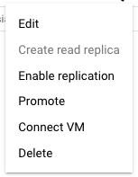
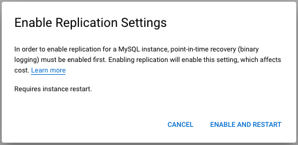
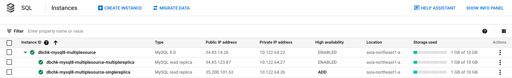
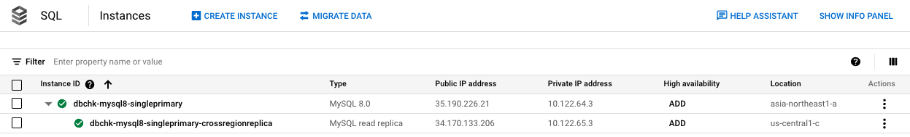
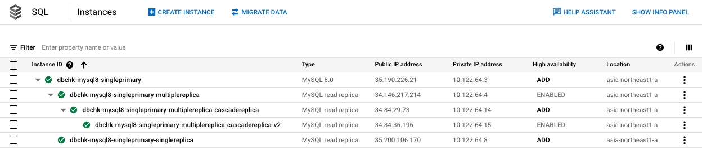

# レプリケーションについて

## 概要

Cloud SQL インスタンスのレプリケーション機能について

```
# About replication in Cloud SQL

https://cloud.google.com/sql/docs/mysql/replication
https://cloud.google.com/sql/docs/postgres/replication
https://cloud.google.com/sql/docs/sqlserver/replication
```

+ 呼び方
  + メインのインスタンス = `primary instance`
  + レプリケーション先のインスタンス = `read replica`

## 1. MySQL のレプリケーションについて

以下のレプリケーションをサポートしている

1. [Read replicas](https://cloud.google.com/sql/docs/mysql/replication#read-replicas)
1. [Cross-region read replicas](https://cloud.google.com/sql/docs/mysql/replication#cross-region-read-replicas)
1. [Cascading read replicas](https://cloud.google.com/sql/docs/mysql/replication#cascading-replicas)
1. [External read replicas](https://cloud.google.com/sql/docs/mysql/replication#external-read-replicas)

## 2. Read Replica について

構成例( `asia-northeast1` )

<details>
<summary>2-1. プライマリの Instance の Zonal availability が Single Zone の場合</summary>

+ 構成



+ **Enable replication** を実行することで、レプリケーションが始まる






</details>


<details>
<summary>2-2. プライマリの Instance の Zonal availability が Multiple zones( Highly available )の場合</summary>



</details>


## 3. Cross-region read replicas について

プライマリとリードレプリカを異なるリージョンで作成することが出来る

クロスリージョンレプリカの利点などは -> https://cloud.google.com/sql/docs/mysql/replication/#cross-region-read-replicas

<details>
<summary>スクリーンショット</summary>

+ `asia-northeast1-a` と `us-central1-c` でレプリケーションしている例



</details>

## 4. Cascading read replicas について

リードレプリカのインスタンスをカスケード( 小さな滝のような階段型の階層 )で作ることが出来る

カスケードレプリカの利点などは -> https://cloud.google.com/sql/docs/mysql/replication/#cascading-replicas

カスケードレプリカはプライマリインスタンスを入れて、最大で 4 階層作ることが出来る

<details>
<summary>スクリーンショット</summary>



</details>

## 5. External read replicas について

<details>
<summary>WIP</summary>

[About replicating from an external server](https://cloud.google.com/sql/docs/mysql/replication/external-server)

```
## memo

MySQL on GCE -> Cloud SQL
Cloud SQL -> MySQL on GCE

の両方を試したい

上記はハンズオン形式で作成する
```

---> https://github.com/iganari/handson-cloudsql-replication

</details>
