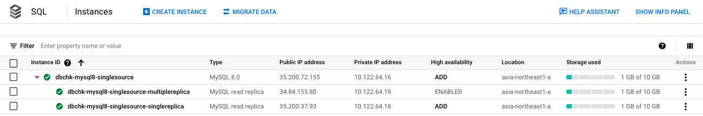

# レプリケーションについて

## 概要

Cloud SQL インスタンスのレプリケーション機能について

```
# About replication in Cloud SQL

https://cloud.google.com/sql/docs/mysql/replication
https://cloud.google.com/sql/docs/postgres/replication
https://cloud.google.com/sql/docs/sqlserver/replication
```

## 1. MySQL のレプリケーションについて

以下のレプリケーションをサポートしている

1. [Read replicas](https://cloud.google.com/sql/docs/mysql/replication#read-replicas)
1. [Cross-region read replicas](https://cloud.google.com/sql/docs/mysql/replication#cross-region-read-replicas)
1. [Cascading read replicas](https://cloud.google.com/sql/docs/mysql/replication#cascading-replicas)
1. [External read replicas](https://cloud.google.com/sql/docs/mysql/replication#external-read-replicas)

## 2. Read Replica について

<details>
<summary>構成例</summary>

+ メインの Instance の Zonal availability が Single Zone の場合



+ メインの Instance の Zonal availability が ultiple zones(　Highly available　)の場合


</details>


