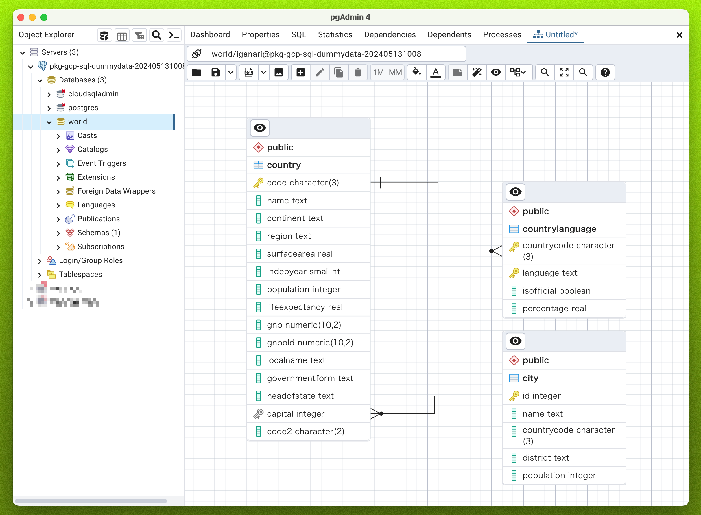

# Cloud SQL for PostgreSQL にサンプルデータを入れる

## 概要

Cloud SQL for PostgreSQL にサンプルデータをいれるサンプルです

### 使用するサンプルデータ

- PostgreSQL 公式
  - https://www.postgresql.org/ftp/projects/pgFoundry/dbsamples/world/

## 1. Cloud SQL Instance の用意

+ 環境変数を設定する

```
### Cloud SQL Instance の設定

export _gc_pj_id='Your Google Cloud Project ID'

export _common='pkg-gcp-sql-dummydata'
export _instance_type='db-g1-small'
export _region='asia-northeast1'

export _instance_name="$(echo ${_common})-$(date +'%Y%m%d%H%M')"
echo ${_instance_name}
```
```
### データベースの設定

export _psgrs_ver='POSTGRES_15'
export _psgrs_passwd="$(echo ${_gc_pj_id})"
```

<details>
<summary>1-1. Pubulic IP Address 付きの Cloud SQL Instance の作成を行う</summary>

- [Cloud SQL の gcloud コマンド](../../_gcloud/) を参考に **Pubulic IP Address 付きの Cloud SQL Instance** の作成を行う

```
### Public IP Address のみ
gcloud beta sql instances create ${_instance_name} \
  --database-version ${_mysql_ver} \
  --root-password "${_mysql_root_passwd}" \
  --tier ${_instance_type} \
  --region ${_region} \
  --project ${_gc_pj_id} \
  --async
```

</details>

<details>
<summary>1-2. Cloud SQL Instance の情報の確認</summary>

```
gcloud beta sql instances describe ${_instance_name} --project ${_gc_pj_id} --format json
```
```
### サンプル

$ gcloud beta sql instances describe ${_instance_name} --project ${_gc_pj_id} --format json
{
  "backendType": "SECOND_GEN",
  "connectionName": "hogehoge:asia-northeast1:pkg-gcp-sql-dummydata-202405131008",
  "createTime": "2024-05-13T01:14:46.086Z",
  "databaseInstalledVersion": "POSTGRES_15_5",
  "databaseVersion": "POSTGRES_15",
  "etag": "af7fbe6eed450fee17bfdfdsafsdfdsgdsfasdfasdfasf",
  "gceZone": "asia-northeast1-b",
  "geminiConfig": {
    "activeQueryEnabled": false,
    "entitled": false,
    "googleVacuumMgmtEnabled": false,
    "indexAdvisorEnabled": false,
    "oomSessionCancelEnabled": false
  },

...
```

</details>

## 2. Database の作成

<details>
<summary>2-1. world 用のサンプルデータ用の Database の作成</summary>

```
export _database_name='world'
export _database_character_set='utf8'
```
```
gcloud beta sql databases create ${_database_name} \
  --instance ${_instance_name} \
  --charset ${_database_character_set} \
  --project ${_gc_pj_id} \
  --async
```

</details>

```
gcloud beta sql databases
https://cloud.google.com/sdk/gcloud/reference/beta/sql/databases
```

## 3. User の作成

+ 環境変数に入れる

```
export _user_name='iganari'
export _user_passwd='0123456789abcsd'
```
```
gcloud beta sql users create ${_user_name} \
  --password ${_user_passwd} \
  --host "%" \
  --instance ${_instance_name} \
  --project ${_gc_pj_id} \
  --async
```

## 4. Cloud Storage の準備

Cloud SQL にサンプルデータを入れる際に Cloud Storage を利用したいと思いますので、その準備をします

<details>
<summary>4-1. Cloud Storage Buckets の作成</summary>

- Buckets 自体は `Uniform` で作成する

```
gcloud storage buckets create gs://${_gc_pj_id}-${_common} \
  --location ${_region} \
  --uniform-bucket-level-access \
  --project ${_gc_pj_id}
```

</details>

<details>
<summary>4-2. Cloud Storage のマネージドフォルダの作成</summary>

- [マネージドフォルダ](https://cloud.google.com/storage/docs/creating-managing-managed-folders?hl=en#command-line) を作成する
  - フォルダレベルで権限を付与することが出来るため

```
gcloud storage managed-folders create gs://${_gc_pj_id}-${_common}/pgsql --project ${_gc_pj_id}
```

</details>


<details>
<summary>4-3. Cloud Storage のマネージドフォルダに Cloud SQL Instance が Cloud Storage のマネージドフォルダを読み込みる様に権限設定をする</summary>

- Cloud SQL Instance の Service Account を調べる

```
gcloud beta sql instances describe ${_instance_name} --project ${_gc_pj_id} --format json | jq -r .serviceAccountEmailAddress

export _sql_instance_sa=`gcloud beta sql instances describe ${_instance_name} --project ${_gc_pj_id} --format json | jq -r .serviceAccountEmailAddress`
echo ${_sql_instance_sa}
```

- マネージドフォルダの権限の設定
  - https://cloud.google.com/storage/docs/access-control/using-iam-for-managed-folders?hl=en
  - JSON を用いる必要がある

- JSON ファイルの作成

```
export _role='roles/storage.objectViewer'
export _member=`echo serviceAccount:${_sql_instance_sa}`
```
```
cat << __EOF__ > permission.json
{
  "bindings":[
    {
      "role": "${_role}",
      "members":[
        "${_member}"
      ]
    }
  ]
}
__EOF__
```

- 権限の設定

```
gcloud storage managed-folders set-iam-policy \
  gs://${_gc_pj_id}-${_common}/pgsql \
  permission.json \
  --project ${_gc_pj_id}
```

</details>


## 5. サンプルデータ

<details>
<summary>5-1. PostgreSQL 公式のサンプルデータを Cloud Storage にアップロードする</summary>

```
https://ftp.postgresql.org/pub/projects/pgFoundry/dbsamples/world/world-1.0/world-1.0.tar.gz
```

- ダウンロードと tar.gz の解凍

```
cd /tmp

curl -O https://ftp.postgresql.org/pub/projects/pgFoundry/dbsamples/world/world-1.0/world-1.0.tar.gz
tar -zxvf ./world-1.0.tar.gz
```

- サンプルデータの確認

```
ls -la dbsamples-0.1/world/
```
```
### 例

$ ls -la dbsamples-0.1/world/
total 208
drwxr-xr-x 2 iganari iganari   4096 Nov 10  2005 .
drwxr-xr-x 3 iganari iganari   4096 Nov 10  2005 ..
-rw-r--r-- 1 iganari iganari    414 Nov 10  2005 README
-rw-r--r-- 1 iganari iganari 198552 Nov 10  2005 world.sql
```

- Cloud Storage にアップロード

```
gcloud storage cp -r dbsamples-0.1/world gs://${_gc_pj_id}-${_common}/pgsql/
```

</details>


## SQL にインポートする


```
gcloud beta sql import sql ${_instance_name} \
  gs://${_gc_pj_id}-${_common}/pgsql/world/world.sql \
  --database world \
  --project ${_gc_pj_id} \
  --quiet \
  --async
```


## 確認

