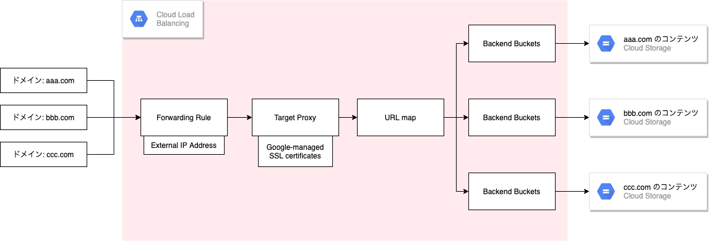
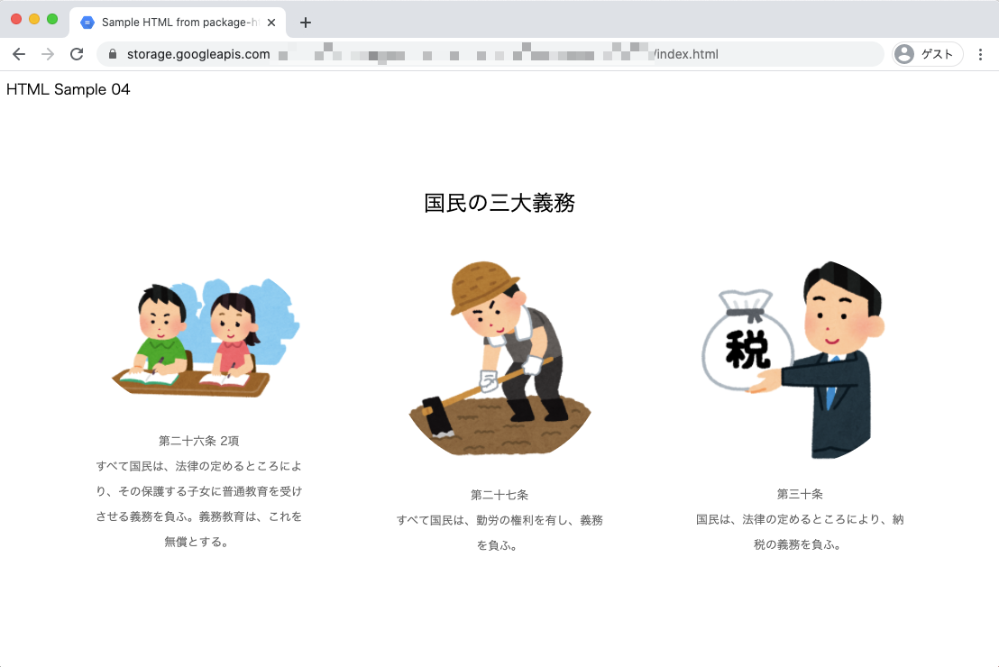

# 複数の静的ウェブサイトのホスティング

## 概要

以下の構成を作成する



## 公式ドキュメント

https://cloud.google.com/storage/docs/hosting-static-website?hl=ja

## 参考

[単一の静的ウェブサイトのホスティング](../hosting-static-website-single/)

## 実際にやってみる

```
### 環境変数

export _gcp_pj_id='Your GCP Project ID'
export _common='hosting-static-website-multi'
```

+ [GCS の設定](./README.md#gcs-の設定)
    + [GCS バケットを用意する](./README.md#gcs-バケットを用意する)
    + [静的サイト用のファイルを GCS にアップロードする](./README.md#静的サイト用のファイルを-gcs-にアップロードする)
    + [GCS バケットの公開設定を行う](./README.md#gcs-バケットの公開設定を行う)
    + [特殊ページの設定](./README.md#特殊ページの設定)
+ [Cloud Load Balancing とマネージド SSL 証明書を設定](./README.md#cloud-load-balancing-とマネージド-ssl-証明書を設定)
    + [GCLB で使用する External IP Address を予約する](./README.md#gclb-で使用する-external-ip-address-を予約する)
    + [ドメインの準備](./README.md#ドメインの準備)
    + [Backend Buckets の作成](./README.md#backend-buckets-の作成)
    + [URL map の作成](./README.md#url-map-の作成)
    + [Google-managed SSL certificates の作成](./README.md#google-managed-ssl-certificates-の作成)
    + [Target Proxy の作成](./README.md#target-proxy-の作成)
    + [Forwarding Rule の作成](./README.md#forwarding-rule-の作成)


## GCS の設定

### GCS バケットを用意する

```
gsutil mb -p ${_gcp_pj_id} gs://${_gcp_pj_id}-${_common}-02
gsutil mb -p ${_gcp_pj_id} gs://${_gcp_pj_id}-${_common}-03
gsutil mb -p ${_gcp_pj_id} gs://${_gcp_pj_id}-${_common}-04
```

### 静的サイト用のファイルを GCS にアップロードする

+ サンプルコードのダウンロード

```
git clone https://github.com/iganari/package-html-css.git
```

+ GCS にアップロード

```
gsutil cp -r package-html-css/200-02/* gs://${_gcp_pj_id}-${_common}-02
gsutil cp -r package-html-css/200-03/* gs://${_gcp_pj_id}-${_common}-03
gsutil cp -r package-html-css/200-04/* gs://${_gcp_pj_id}-${_common}-04
```

### GCS バケットの公開設定を行う

+ 公共のインターネット上で誰もがバケット内のすべてのオブジェクトを閲覧できるようにする

```
gsutil iam ch allUsers:objectViewer gs://${_gcp_pj_id}-${_common}-02
gsutil iam ch allUsers:objectViewer gs://${_gcp_pj_id}-${_common}-03
gsutil iam ch allUsers:objectViewer gs://${_gcp_pj_id}-${_common}-04
```

### 特殊ページの設定

+ インデックスページや 404 ページを指定する
    + インデックスページを設定しない場合、 / でアクセスすると残念な感じになってる
    + 参考
        + https://cloud.google.com/storage/docs/static-website?hl=ja#specialty_pages

+ 404 ページがない場合

```
gsutil web set -m index.html gs://${_gcp_pj_id}-${_common}-02
gsutil web set -m index.html gs://${_gcp_pj_id}-${_common}-03
gsutil web set -m index.html gs://${_gcp_pj_id}-${_common}-04
```

+ 404 ページがある場合

```
gsutil web set -m index.html -e 404.html gs://${_gcp_pj_id}-${_common}-02
gsutil web set -m index.html -e 404.html gs://${_gcp_pj_id}-${_common}-03
gsutil web set -m index.html -e 404.html gs://${_gcp_pj_id}-${_common}-04
```

## Cloud Load Balancing とマネージド SSL 証明書を設定

### GCLB で使用する External IP Address を予約する

+ 予約

```
gcloud compute addresses create ${_common}-ip-02 \
    --ip-version=IPV4 \
    --global \
    --project ${_gcp_pj_id}

gcloud compute addresses create ${_common}-ip-03 \
    --ip-version=IPV4 \
    --global \
    --project ${_gcp_pj_id}

gcloud compute addresses create ${_common}-ip-04 \
    --ip-version=IPV4 \
    --global \
    --project ${_gcp_pj_id}
```

+ 確認

```
gcloud compute addresses describe ${_common}-ip-02 \
    --format="get(address)" \
    --global \
    --project ${_gcp_pj_id}
```
```
### 例

# gcloud compute addresses describe ${_common}-ip-02 \
>     --format="get(address)" \
>     --global \
>     --project ${_gcp_pj_id}
34.117.177.29
```

### ドメインの準備

先程予約した External IP Address と自分が持っているドメインに登録しておく

+ 今回は以下のように設定

```
hosting-static-website-multi-02.iganari.xyz 34.98.87.59
hosting-static-website-multi-03.iganari.xyz 34.98.87.59
hosting-static-website-multi-04.iganari.xyz 34.98.87.59
```


+ コマンドラインで確認

```
dig A hosting-static-website-multi-02.iganari.xyz +short
dig A hosting-static-website-multi-03.iganari.xyz +short
dig A hosting-static-website-multi-04.iganari.xyz +short
```
```
### 例

% dig A hosting-static-website-multi-02.iganari.xyz +short
34.98.87.59
```

### Backend Buckets の作成

+ 作成

```
gcloud beta compute backend-buckets create ${_common}-backend-bucket-02 \
    --gcs-bucket-name ${_gcp_pj_id}-${_common}-02 \
    --project ${_gcp_pj_id}
```
```
gcloud beta compute backend-buckets create ${_common}-backend-bucket-03 \
    --gcs-bucket-name ${_gcp_pj_id}-${_common}-03 \
    --project ${_gcp_pj_id}
```
```
gcloud beta compute backend-buckets create ${_common}-backend-bucket-04 \
    --gcs-bucket-name ${_gcp_pj_id}-${_common}-04 \
    --project ${_gcp_pj_id}
```

+ 確認

```
gcloud beta compute backend-buckets list \
    --project ${_gcp_pj_id}
```
```
### 例

# gcloud beta compute backend-buckets list \
>     --project ${_gcp_pj_id}
NAME                                            GCS_BUCKET_NAME                                       ENABLE_CDN
hosting-static-website-multi-backend-bucket-02  xxxxxxxxxxxxxxxxxxxx-hosting-static-website-multi-02  False
hosting-static-website-multi-backend-bucket-03  xxxxxxxxxxxxxxxxxxxx-hosting-static-website-multi-03  False
hosting-static-website-multi-backend-bucket-04  xxxxxxxxxxxxxxxxxxxx-hosting-static-website-multi-04  False
```

### URL map の作成

+ 作成

```
gcloud beta compute url-maps create ${_common}-url-map \
    --default-backend-bucket ${_common}-backend-bucket-02 \
    --project ${_gcp_pj_id}
```
```
gcloud beta compute url-maps add-path-matcher ${_common}-url-map \
    --path-matcher-name path-matcher-02 \
    --new-hosts hosting-static-website-multi-02.iganari.xyz \
    --default-backend-bucket ${_common}-backend-bucket-02 \
    --project ${_gcp_pj_id}

gcloud beta compute url-maps add-path-matcher ${_common}-url-map \
    --path-matcher-name path-matcher-03 \
    --new-hosts hosting-static-website-multi-03.iganari.xyz \
    --default-backend-bucket ${_common}-backend-bucket-03 \
    --project ${_gcp_pj_id}

gcloud beta compute url-maps add-path-matcher ${_common}-url-map \
    --path-matcher-name path-matcher-04 \
    --new-hosts hosting-static-website-multi-04.iganari.xyz \
    --default-backend-bucket ${_common}-backend-bucket-04 \
    --project ${_gcp_pj_id}
```


+ 確認

```
gcloud beta compute url-maps list --project ${_gcp_pj_id}
```
```
### 例

# gcloud beta compute url-maps list --project ${_gcp_pj_id}
NAME                                   DEFAULT_SERVICE
hosting-static-website-multi-url-map   backendBuckets/hosting-static-website-multi-backend-bucket-02
```

### Google-managed SSL certificates の作成

```
export _my_domain_02='hosting-static-website-multi-02.iganari.xyz'
export _my_domain_03='hosting-static-website-multi-03.iganari.xyz'
export _my_domain_04='hosting-static-website-multi-04.iganari.xyz'
```

+ 作成

```
gcloud beta compute ssl-certificates create ${_common}-cert-02 \
    --domains ${_common}-02.iganari.xyz \
    --project ${_gcp_pj_id}

gcloud beta compute ssl-certificates create ${_common}-cert-03 \
    --domains ${_common}-03.iganari.xyz \
    --project ${_gcp_pj_id}

gcloud beta compute ssl-certificates create ${_common}-cert-04 \
    --domains ${_common}-04.iganari.xyz \
    --project ${_gcp_pj_id}
```

+ 確認

```
gcloud beta compute ssl-certificates list --project ${_gcp_pj_id}
```
```
### 例

# gcloud beta compute ssl-certificates list --project ${_gcp_pj_id}
NAME                                  TYPE     CREATION_TIMESTAMP             EXPIRE_TIME                    MANAGED_STATUS
hosting-static-website-multi-cert-02  MANAGED  2021-03-02T16:06:32.689-08:00                                 PROVISIONING
    hosting-static-website-multi-02.iganari.xyz: PROVISIONING
hosting-static-website-multi-cert-03  MANAGED  2021-03-02T16:06:41.269-08:00                                 PROVISIONING
    hosting-static-website-multi-03.iganari.xyz: PROVISIONING
hosting-static-website-multi-cert-04  MANAGED  2021-03-02T16:06:50.213-08:00                                 PROVISIONING
    hosting-static-website-multi-04.iganari.xyz: PROVISIONING
```

### Target Proxy の作成

+ 作成

```
gcloud beta compute target-https-proxies create ${_common}-https-proxy-02 \
    --ssl-certificates=${_common}-cert-02 \
    --url-map=${_common}-url-map \
    --global \
    --project ${_gcp_pj_id}

gcloud beta compute target-https-proxies create ${_common}-https-proxy-03 \
    --ssl-certificates=${_common}-cert-03 \
    --url-map=${_common}-url-map \
    --global \
    --project ${_gcp_pj_id}

gcloud beta compute target-https-proxies create ${_common}-https-proxy-04 \
    --ssl-certificates=${_common}-cert-04 \
    --url-map=${_common}-url-map \
    --global \
    --project ${_gcp_pj_id}
```

+ 確認

```
gcloud beta compute target-https-proxies list --project ${_gcp_pj_id}
```
```
### 例

# gcloud beta compute target-https-proxies list --project ${_gcp_pj_id}
NAME                                         SSL_CERTIFICATES                      URL_MAP
hosting-static-website-multi-https-proxy-02  hosting-static-website-multi-cert-02  hosting-static-website-multi-url-map
hosting-static-website-multi-https-proxy-03  hosting-static-website-multi-cert-03  hosting-static-website-multi-url-map
hosting-static-website-multi-https-proxy-04  hosting-static-website-multi-cert-04  hosting-static-website-multi-url-map
```

### Forwarding Rule の作成

+ 作成

```
gcloud beta compute forwarding-rules create ${_common}-https-rule-02 \
    --address=${_common}-ip-02 \
    --target-https-proxy=${_common}-https-proxy-02 \
    --global \
    --ports=443 \
    --project ${_gcp_pj_id}

gcloud beta compute forwarding-rules create ${_common}-https-rule-03 \
    --address=${_common}-ip-03 \
    --target-https-proxy=${_common}-https-proxy-03 \
    --global \
    --ports=443 \
    --project ${_gcp_pj_id}

gcloud beta compute forwarding-rules create ${_common}-https-rule-04 \
    --address=${_common}-ip-04 \
    --target-https-proxy=${_common}-https-proxy-04 \
    --global \
    --ports=443 \
    --project ${_gcp_pj_id}
```

+ 確認

```
gcloud beta compute forwarding-rules list --project ${_gcp_pj_id}
```
```
### 例

# gcloud beta compute forwarding-rules list --project ${_gcp_pj_id}
NAME                                        REGION  IP_ADDRESS      IP_PROTOCOL  TARGET
hosting-static-website-multi-https-rule-02          34.117.177.29   TCP          hosting-static-website-multi-https-proxy-02
hosting-static-website-multi-https-rule-03          34.120.18.82    TCP          hosting-static-website-multi-https-proxy-03
hosting-static-website-multi-https-rule-04          34.98.105.79    TCP          hosting-static-website-multi-https-proxy-04
```

## 確認

### GCS

GCS を一般公開したので以下の URL で見ることが出来る

```
https://storage.googleapis.com/${_gcp_pj_id}-${_common}-02/index.html
https://storage.googleapis.com/${_gcp_pj_id}-${_common}-03/index.html
https://storage.googleapis.com/${_gcp_pj_id}-${_common}-04/index.html
```




### LB 越し

```
https://hosting-static-website-multi-02.iganari.xyz
https://hosting-static-website-multi-03.iganari.xyz
https://hosting-static-website-multi-04.iganari.xyz
```


## リソースの削除

### ドメインの削除

各自削除

### LB の削除

+ Forwarding Rule

```
gcloud beta compute forwarding-rules delete ${_common}-https-rule-02 \
    --global \
    --project ${_gcp_pj_id}

gcloud beta compute forwarding-rules delete ${_common}-https-rule-03 \
    --global \
    --project ${_gcp_pj_id}

gcloud beta compute forwarding-rules delete ${_common}-https-rule-04 \
    --global \
    --project ${_gcp_pj_id}
```

+ Target Proxy

```
gcloud beta compute target-https-proxies delete ${_common}-https-proxy-02 \
    --global \
    --project ${_gcp_pj_id}

gcloud beta compute target-https-proxies delete ${_common}-https-proxy-03 \
    --global \
    --project ${_gcp_pj_id}

gcloud beta compute target-https-proxies delete ${_common}-https-proxy-04 \
    --global \
    --project ${_gcp_pj_id}
```

+ Certificate

```
gcloud beta compute ssl-certificates delete ${_common}-cert-02 \
    --project ${_gcp_pj_id}

gcloud beta compute ssl-certificates delete ${_common}-cert-03 \
    --project ${_gcp_pj_id}

gcloud beta compute ssl-certificates delete ${_common}-cert-04 \
    --project ${_gcp_pj_id}
```

+ URL map

```
gcloud beta compute url-maps delete ${_common}-url-map \
    --project ${_gcp_pj_id}
```

+ Backend Buckets

```
gcloud beta compute backend-buckets delete ${_common}-backend-bucket-02 \
    --project ${_gcp_pj_id}

gcloud beta compute backend-buckets delete ${_common}-backend-bucket-03 \
    --project ${_gcp_pj_id}

gcloud beta compute backend-buckets delete ${_common}-backend-bucket-04 \
    --project ${_gcp_pj_id}
```

+ External IP Address

```
gcloud compute addresses delete ${_common}-ip-02 \
    --global \
    --project ${_gcp_pj_id}

gcloud compute addresses delete ${_common}-ip-03 \
    --global \
    --project ${_gcp_pj_id}

gcloud compute addresses delete ${_common}-ip-04 \
    --global \
    --project ${_gcp_pj_id}
```

### GCS

+ GCS バケットの削除

```
gsutil rm -r gs://${_gcp_pj_id}-${_common}-02
gsutil rm -r gs://${_gcp_pj_id}-${_common}-03
gsutil rm -r gs://${_gcp_pj_id}-${_common}-04
```

## まとめ

Have fun! :)
