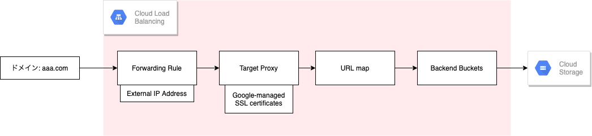
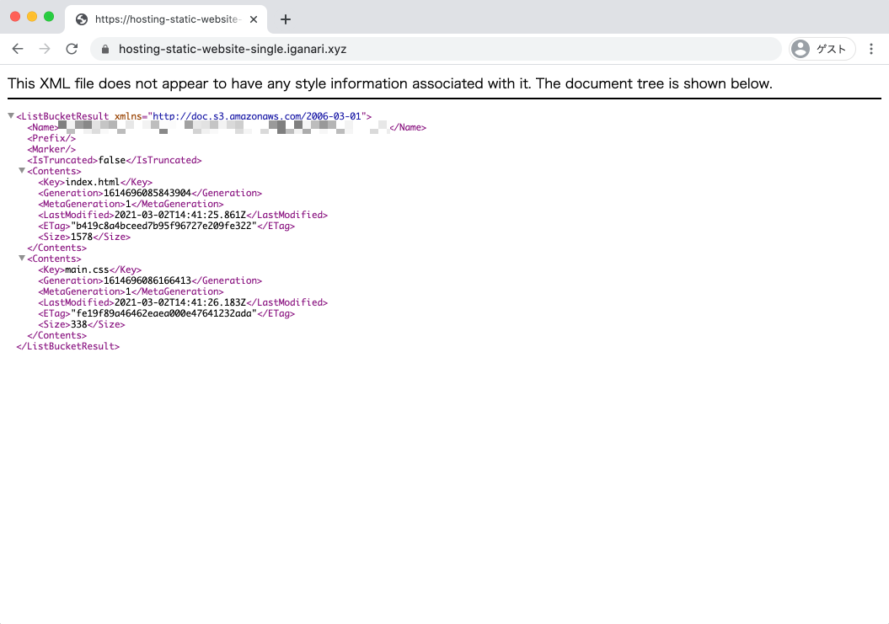

# 単一の静的ウェブサイトのホスティング

## 概要

以下の構成を作成する



## 公式ドキュメント

https://cloud.google.com/storage/docs/hosting-static-website?hl=ja

## 参考

[複数の静的ウェブサイトのホスティング](../hosting-static-website-multi/)

## 実際にやってみる

```
### 環境変数

export _gcp_pj_id='Your GCP Project ID'
export _common='hosting-static-website-single'
```

## GCS の設定

### GCS バケットを用意する

```
gsutil mb -p ${_gcp_pj_id} gs://${_gcp_pj_id}-${_common}
```

### 静的サイト用のファイルを GCS にアップロードする

+ サンプルコードのダウンロード

```
git clone https://github.com/iganari/package-html-css.git
```

+ GCS にアップロード

```
gsutil cp -r package-html-css/200-01/* gs://${_gcp_pj_id}-${_common}
```

### GCS バケットの公開設定を行う

+ 公共のインターネット上で誰もがバケット内のすべてのオブジェクトを閲覧できるようにする

```
gsutil iam ch allUsers:objectViewer gs://${_gcp_pj_id}-${_common}
```

### 特殊ページの設定

+ インデックスページや 404 ページを指定する
    + インデックスページを設定しない場合、 `/` でアクセスすると残念な感じになってる
    + 参考
        + https://cloud.google.com/storage/docs/static-website?hl=ja#specialty_pages

+ 404 ページがない場合

```
gsutil web set -m index.html gs://${_gcp_pj_id}-${_common}
```

+ 404 ページがある場合

```
gsutil web set -m index.html -e 404.html gs://${_gcp_pj_id}-${_common}
```

## LoadBalancer とマネージド SSL 証明書を設定する

### LB で使用する External IP Address を予約する

+ 予約

```
gcloud compute addresses create ${_common}-ip \
    --ip-version=IPV4 \
    --global \
    --project ${_gcp_pj_id}
```

+ 確認

```
gcloud compute addresses describe ${_common}-ip \
    --format="get(address)" \
    --global \
    --project ${_gcp_pj_id}
```
```
### 例

# gcloud compute addresses describe ${_common}-ip \
>     --format="get(address)" \
>     --global \
>     --project ${_gcp_pj_id}
34.102.192.124
```

### ドメインの準備

先程予約した External IP Address を自分が持っているドメインに登録しておく

+ 今回は以下のように設定

```
hosting-static-website-single.iganari.xyz 34.102.192.124
```


+ コマンドラインで確認

```
dig A hosting-static-website-single.iganari.xyz +short
```
```
### 例

$ dig A hosting-static-website-single.iganari.xyz +short
34.102.192.124
```

### Backend Buckets の作成

+ 作成

```
gcloud beta compute backend-buckets create ${_common}-backend-bucket \
    --gcs-bucket-name ${_gcp_pj_id}-${_common} \
    --project ${_gcp_pj_id}
```

+ 確認

```
gcloud beta compute backend-buckets list \
    --project ${_gcp_pj_id}
```
```
### 例

# gcloud beta compute backend-buckets list \
>     --project ${_gcp_pj_id}
NAME                                          GCS_BUCKET_NAME                                     ENABLE_CDN
hosting-static-website-single-backend-bucket  xxxxxxxxxxxxxxxxxxxx-hosting-static-website-single  False
```

### URL map

+ 作成

```
gcloud beta compute url-maps create ${_common}-url-map \
    --default-backend-bucket ${_common}-backend-bucket \
    --project ${_gcp_pj_id}
```

+ 確認

```
gcloud beta compute url-maps list --project ${_gcp_pj_id}
```
```
### 例

# gcloud beta compute url-maps list --project ${_gcp_pj_id}
NAME                                   DEFAULT_SERVICE
hosting-static-website-single-url-map  backendBuckets/hosting-static-website-single-backend-bucket
```

### Certificate

```
export _my_domain='hosting-static-website-single.iganari.xyz'
```

+ 作成

```
gcloud beta compute ssl-certificates create ${_common}-cert \
    --domains ${_my_domain} \
    --project ${_gcp_pj_id}
```

+ 確認

```
gcloud beta compute ssl-certificates list --project ${_gcp_pj_id}
```
```
### 例

# gcloud beta compute ssl-certificates list --project ${_gcp_pj_id}
NAME                                TYPE     CREATION_TIMESTAMP             EXPIRE_TIME  MANAGED_STATUS
hosting-static-website-single-cert  MANAGED  2021-03-02T06:47:47.105-08:00               PROVISIONING
    hosting-static-website-single.iganari.xyz: PROVISIONING
```

### Target Proxy

+ 作成

```
gcloud beta compute target-https-proxies create ${_common}-https-proxy \
    --ssl-certificates=${_common}-cert \
    --url-map=${_common}-url-map \
    --global \
    --project ${_gcp_pj_id}
```

+ 確認

```
gcloud beta compute target-https-proxies list --project ${_gcp_pj_id}
```
```
### 例

# gcloud beta compute target-https-proxies list --project ${_gcp_pj_id}
NAME                                       SSL_CERTIFICATES                    URL_MAP
hosting-static-website-single-https-proxy  hosting-static-website-single-cert  hosting-static-website-single-url-map
```

### Forwarding Rule

+ 作成

```
gcloud beta compute forwarding-rules create ${_common}-https-rule \
    --address=${_common}-ip \
    --target-https-proxy=${_common}-https-proxy \
    --global \
    --ports=443 \
    --project ${_gcp_pj_id}
```

+ 確認

```
gcloud beta compute forwarding-rules list --project ${_gcp_pj_id}
```
```
### 例

# gcloud beta compute forwarding-rules list --project ${_gcp_pj_id}
NAME                                      REGION  IP_ADDRESS      IP_PROTOCOL  TARGET
hosting-static-website-single-https-rule          34.102.192.124  TCP          hosting-static-website-single-https-proxy
```

## 確認

### GCS

GCS を一般公開したので以下の URL で見ることが出来る

```
https://storage.googleapis.com/${_gcp_pj_id}-${_common}/index.html
```


### LB 越し

+ インデックスを指定しない場合に `/` で出るエラー



+ `/index.html` でアクセスした場合


+ インデックスの指定をすると、 `/` にアクセスしてもちゃんとページが出る


## リソースの削除

### ドメインの削除

各自削除

### LB の削除

+ Forwarding Rule

```
gcloud beta compute forwarding-rules delete ${_common}-https-rule \
    --global \
    --project ${_gcp_pj_id}
```

+ Target Proxy

```
gcloud beta compute target-https-proxies delete ${_common}-https-proxy \
    --global \
    --project ${_gcp_pj_id}
```

+ Certificate

```
gcloud beta compute ssl-certificates delete ${_common}-cert \
    --project ${_gcp_pj_id}
```

+ URL map

```
gcloud beta compute url-maps delete ${_common}-url-map \
    --project ${_gcp_pj_id}
```

+ Backend Buckets

```
gcloud beta compute backend-buckets delete ${_common}-backend-bucket \
    --project ${_gcp_pj_id}
```

+ External IP Address

```
gcloud compute addresses delete ${_common}-ip \
    --global \
    --project ${_gcp_pj_id}
```

### GCS

+ GCS バケットの削除

```
gsutil rm -r gs://${_gcp_pj_id}-${_common}
```

## まとめ

Have fun! :)
